# FirstOrbit — 아키텍처 & 물리 엔진 기술 문서

> **이 문서의 목적**
> 포트폴리오/기술 면접에서 "이 프로젝트가 실제로 어떻게 동작하는가"를 코드와 수식 레벨에서
> 끝까지 설명하기 위한 레퍼런스. 회고(`기술_회고_포트폴리오.md`)가 *무엇을 왜 만들었는가*라면,
> 이 문서는 *어떻게 만들어져 있는가*를 빠짐없이 다룬다.
>
> | 문서 | 성격 |
> |---|---|
> | `README.md` | 프로젝트 소개 (외부용) |
> | `기술_회고_포트폴리오.md` | 회고 — 판단·트레이드오프·디버깅 방법론 |
> | **이 문서** | **레퍼런스 — 구조·수식·코드흐름 전체** |
> | `1~4주차_troubleShooting.md` | 시간순 버그 기록 (증상/원인/해결) |
> | `설계_클래스다이어그램.md` | 초기 설계 단계의 클래스 다이어그램 |

---

## 목차

**[Part I. 엔진 구조]**
1. [프로젝트 개요](#1-프로젝트-개요)
2. [아키텍처 총론](#2-아키텍처-총론)
3. [프레임 루프와 시간 관리](#3-프레임-루프와-시간-관리)
4. [렌더링 파이프라인](#4-렌더링-파이프라인)
5. [액터 / 컴포넌트 / 충돌](#5-액터--컴포넌트--충돌)
6. [리소스 · 데이터 · 입력 · 사운드](#6-리소스--데이터--입력--사운드)

**[Part II. 수학과 물리]**

7. [좌표계와 행렬 카메라](#7-좌표계와-행렬-카메라)
8. [물리 엔진 — 수치적분](#8-물리-엔진--수치적분)
9. [궤도역학 엔진](#9-궤도역학-엔진)
10. [행성 간 전이 — 람베르트 솔버](#10-행성-간-전이--람베르트-솔버)
11. [SOI 시스템과 궤도 판정](#11-soi-시스템과-궤도-판정)
12. [시간 배속(타임워프)](#12-시간-배속타임워프)

**[Part III. 표현과 흐름]**

13. [절차적 렌더링](#13-절차적-렌더링)
14. [UI 프레임워크](#14-ui-프레임워크)
15. [전체 코드 흐름 시나리오](#15-전체-코드-흐름-시나리오)
16. [성능 예산과 최적화](#16-성능-예산과-최적화)
17. [설계 결정 요약](#17-설계-결정-요약)
18. [부록](#18-부록)

---

# Part I. 엔진 구조

## 1. 프로젝트 개요

### 1.1 스펙

| 항목 | 내용 |
|---|---|
| 장르 | 2D 물리 시뮬레이션 / 조종 게임 |
| 플랫폼 | Windows (WinAPI + GDI) |
| 언어 | C++20 (MSVC, Visual Studio 2022) |
| 외부 의존성 | Dear ImGui(디버그 UI, Debug 빌드 전용) · nlohmann/json · DirectSound |
| **미사용** | 게임 엔진, 물리 엔진, 렌더링 라이브러리, 수학 라이브러리 |
| 논리 해상도 | 게임 600×800 + 사이드 패널 300×800 |
| 목표 프레임 | 120 FPS (소프트웨어 페이싱) |
| 소스 규모 | 약 60개 클래스 / ImGui·json 제외 |

`Vector2`, `Matrix3x3`부터 케플러 방정식 솔버, 람베르트 솔버, 픽셀 단위 렌즈 왜곡까지
전부 직접 구현했다. "물리를 라이브러리 뒤에 숨기지 않는다"가 프로젝트의 전제였기 때문.

### 1.2 게임 흐름

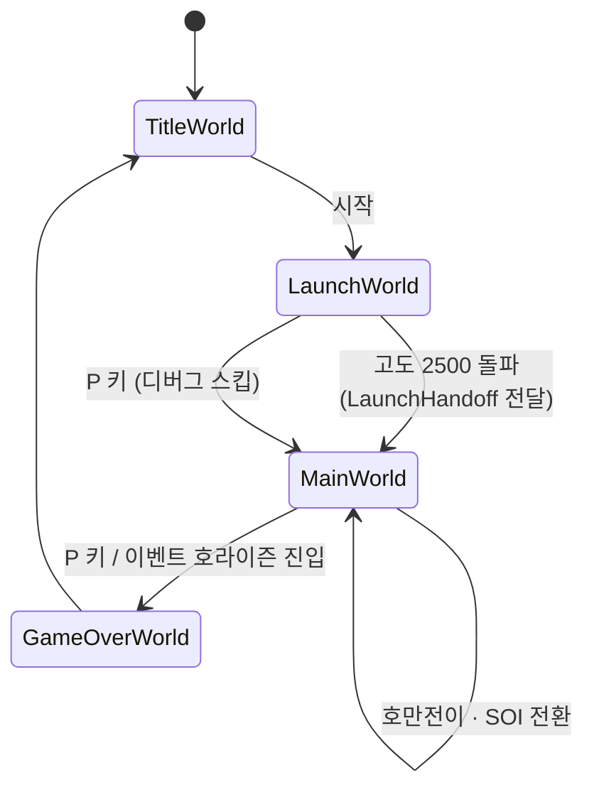

- **LaunchWorld** — 지상 발사. 균일 중력 + 대기 항력, 레일리 산란 하늘, 카운트다운,
  자동 조종(중력 선회), 고도에 따른 줌아웃/대기권 띠.
- **MainWorld** — 태양계 스케일. 케플러 궤도 8행성 + 달 + 블랙홀, SOI 자동 전환,
  람베르트 기반 행성 간 전이, 시간 배속, 사이드뷰 토글.

### 1.3 화면 구성

```
┌──────────────────────────────┬──────────────┐
│                              │  First Orbit │
│                              │  속도: 124.0 │
│      게임 뷰포트              │  근지점: ... │  ← 사이드 UI 패널
│      (600 × 800 논리)         │  원지점: ... │    (300 × 800 논리)
│                              │  [Ship]      │
│      우주선 · 행성 · 궤도선    │  [Sun]       │
│                              │  [Earth][Moon]│
│                              │  [x1][x10]...│
│                              │  [Refuel] ▓▓ │
└──────────────────────────────┴──────────────┘
        _hdcGame 버퍼              _hdcPanel 버퍼
```

두 버퍼는 **각각 고정 논리 해상도**로 그린 뒤, 창 크기에 맞춰 레터박스 합성된다
(§4 참고). 덕분에 World·Camera·Collider 코드는 창 리사이즈를 전혀 몰라도 된다.

---

## 2. 아키텍처 총론

### 2.1 계층 구조

언리얼 엔진의 축소판으로 설계했다. 이름과 역할 분담을 의도적으로 맞춰서, 나중에 실제
엔진으로 옮겨갈 때 개념이 그대로 이어지도록 했다.

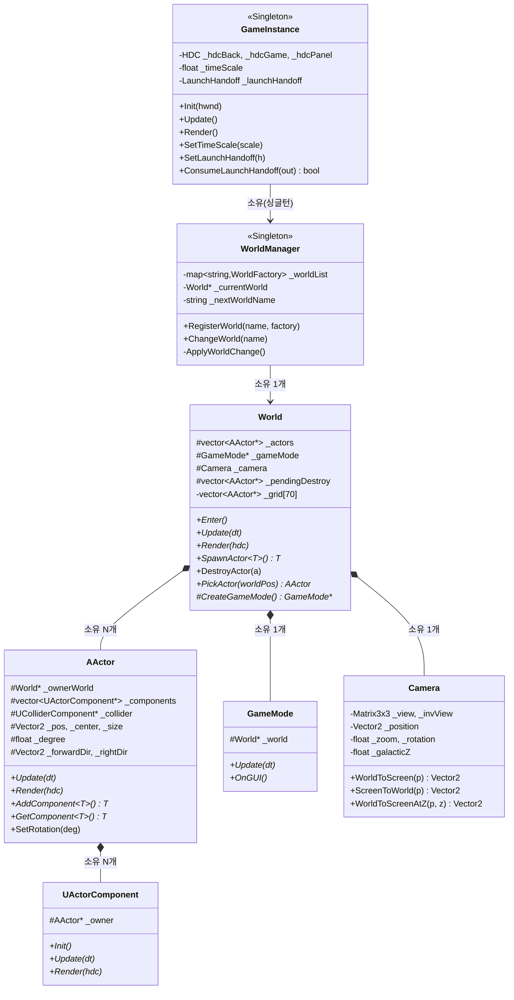

**핵심 소유권 원칙 — 소유자가 곧 해제자**

| 객체 | 소유자 | 해제 시점 |
|---|---|---|
| `World` | `WorldManager` | `ApplyWorldChange()`에서 delete |
| `AActor` | `World::_actors` | `World` 소멸자 / `ProcessPendingDestroy()` |
| `UActorComponent` | `AActor::_components` | `AActor` 소멸자 |
| `GameMode` | `World::_gameMode` | `World` 소멸자 |
| `Widget` | `UIManager::_widgets` | `UI.Clear()` (World 소멸자에서 호출) |
| `Texture` / `Sound` | `ResourceManager` | 앱 종료까지 유지 (씬 전환 시 유지) |

### 2.2 파생 클래스 지도

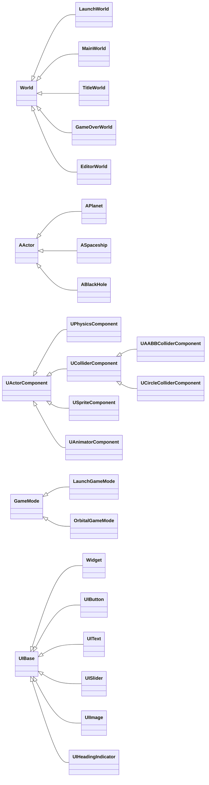

### 2.3 씬 전환의 안전성 — "예약 후 프레임 경계에서 적용"

가장 흔한 크래시 패턴 하나를 구조적으로 차단했다. `World::Update()` 안에서 씬 전환이
트리거되는데(예: `LaunchWorld`가 고도 조건 충족 시 `ChangeWorld` 호출), 그 자리에서
`delete this`가 일어나면 **호출 스택에 살아있는 `this`가 파괴**되어 이후 코드가
전부 use-after-free가 된다.

```mermaid
sequenceDiagram
    participant Loop as WinMain 루프
    participant WM as WorldManager
    participant LW as LaunchWorld
    participant MW as MainWorld

    Loop->>WM: Update(dt)
    WM->>WM: ApplyWorldChange() — 예약 없음, 통과
    WM->>LW: Update(dt)
    LW->>LW: 고도 2500 돌파 감지
    LW->>WM: ChangeWorld("MainWorld")
    Note over WM: _nextWorldName = "MainWorld"<br/>(예약만! delete 없음)
    LW-->>WM: Update 정상 종료
    WM-->>Loop: 반환

    Loop->>WM: Update(dt) — 다음 프레임
    WM->>WM: ApplyWorldChange()
    WM->>LW: delete (콜스택 밖 — 안전)
    WM->>MW: new + Enter()
    WM->>MW: Update(dt)
```

```cpp
void WorldManager::ChangeWorld(const string& name)
{
    assert(_worldList.find(name) != _worldList.end());
    _nextWorldName = name;               // 예약만

    // 첫 부팅만 예외: GameInstance::Init이 이 직후 UIManager를 초기화하며
    // 첫 월드가 로드한 텍스처를 참조하므로, 순서 보장을 위해 즉시 적용한다.
    if (_currentWorld == nullptr)
        ApplyWorldChange();
}
```

같은 철학이 액터 삭제에도 적용된다 — `DestroyActor()`는 `_pendingDestroy`에 넣기만 하고,
실제 삭제는 액터 순회가 끝난 뒤 `ProcessPendingDestroy()`에서 일괄 처리한다. 순회 중
컨테이너를 건드려 반복자가 깨지는 걸 막고, 삭제 전에 겹쳐 있던 상대에게 `EndOverlap`을
빠짐없이 통지할 수 있다.

---

## 3. 프레임 루프와 시간 관리

### 3.1 소프트웨어 V-Sync (WinMain)

GDI 소프트웨어 렌더러라 GPU 스왑체인의 V-Sync가 없다. 대신 `QueryPerformanceCounter`로
120 FPS를 직접 페이싱한다.

```cpp
const LONGLONG frameTicks = frequency.QuadPart / 120;   // 8.33ms
::timeBeginPeriod(1);   // Sleep 해상도 15ms → 1ms (안 하면 8.33ms 간격을 못 맞춤)

while (msg.message != WM_QUIT)
{
    if (PeekMessage(...)) { /* 메시지 우선 처리 */ }
    else
    {
        QueryPerformanceCounter(&now);
        if (now - prev < frameTicks)
        {
            double remainMs = (frameTicks - elapsed) * 1000.0 / frequency;
            if (remainMs > 2.0) ::Sleep((DWORD)(remainMs - 1.0));  // 1ms 덜 자고 스핀
            continue;
        }

        game.Update();
        game.Render();

        prev.QuadPart += frameTicks;                       // ★ '=' 아니라 '+=' 누적
        if (now.QuadPart - prev.QuadPart > frameTicks * 4)  // 4프레임 이상 밀리면 따라잡기 포기
            prev.QuadPart = now.QuadPart;
    }
}
```

세 가지 디테일이 들어있다.

1. **`Sleep(remain - 1)`** — Sleep은 "최소 이만큼"만 보장하므로 정확히 남은 시간을 자면
   항상 초과한다. 1ms 덜 자고 남은 구간은 루프를 돌며 스핀해서 정밀도를 확보한다.
2. **`prev += frameTicks` (누적)** — `prev = now`로 하면 매 프레임 Sleep 오차가 그대로
   쌓여 평균 프레임레이트가 목표보다 낮아진다. 기준 시각을 고정 간격으로 누적하면
   오차가 다음 프레임에서 자동 상쇄되어 **평균 120 FPS로 수렴**한다.
3. **따라잡기 폭주 방지** — 창 드래그나 브레이크포인트로 여러 프레임이 밀렸을 때 누적
   방식은 밀린 만큼 연속으로 프레임을 몰아치려 한다. 4프레임 이상 밀리면 기준 시각을
   현재로 리셋해 "따라잡기"를 포기한다.

### 3.2 델타타임 클램프

```cpp
// TimeManager::Update()
_deltaTime = (currentCount - _prevCount) / (float)_frequency;
if (_deltaTime > GMaxDeltaTime)   // GMaxDeltaTime = 1/10초
    _deltaTime = GMaxDeltaTime;
```

`GetDT()`를 쓰는 **모든** 소비자(World / UI / 타이머)가 잘린 값을 받도록 여기서 한 번만
처리한다. 프레임이 10 FPS 아래로 떨어지면 게임 시간을 실제보다 느리게 흐르게 해서
수치적분 발산과 콜라이더 터널링을 막는 안전장치다.

> 📌 이 상한 하나가 나중에 시간배속 버그의 원인을 계산하는 기준이 된다 —
> 배속 100배에서 한 프레임 최대 스케일 델타타임은 `0.1 × 100 = 10초`. (§12)

### 3.3 프레임 시퀀스 전체

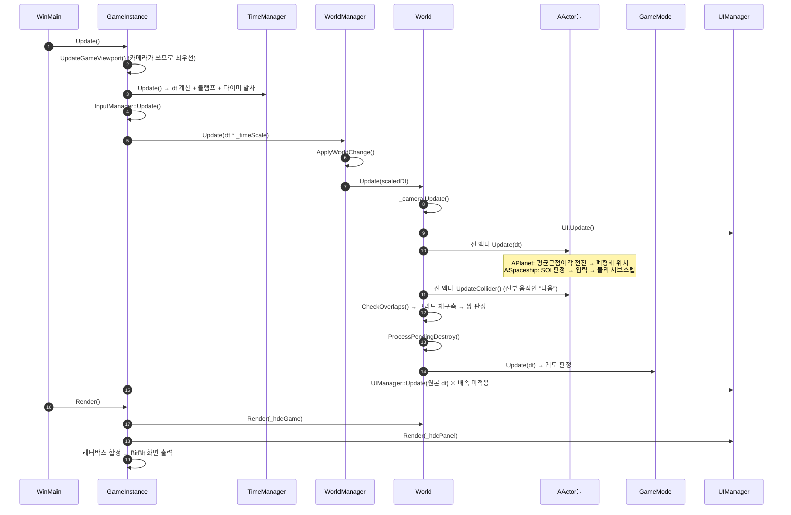

> **UI는 배속의 영향을 받지 않는다** — `WORLD.Update(dt * _timeScale)`와 달리
> `UIManager::Update(deltaTime)`는 원본 델타타임을 받는다. 100배속에서도 버튼 호버
> 애니메이션은 실시간 속도로 동작한다.

### 3.4 타이머 시스템

`TimeManager`는 콜백 타이머를 제공한다(발사 카운트다운 등에 사용). 순회 중 자기 자신을
제거·추가하는 문제를 **추가/제거 대기열**로 분리해 해결했다.

```cpp
// 1) 제거를 "발사보다 먼저" 처리한다.
//    반대로 하면 이전 프레임에 죽은 소유자의 타이머가 한 번 더 실행되어
//    해제된 메모리를 참조한다.
_timers.erase(remove_if(...), _timers.end());
_removeTimers.clear();

// 2) 이번 프레임에 추가 요청된 타이머 반영
_timers.insert(_timers.end(), _addTimers.begin(), _addTimers.end());
_addTimers.clear();

// 3) 발사
for (auto& t : _timers)
    if (t.Update(_deltaTime)) _removeTimers.insert(t.GetId());
```

---

## 4. 렌더링 파이프라인

### 4.1 3단 버퍼 구조

```
┌─ 고정 논리 해상도 영역 (창 크기와 무관) ─────────────────────┐
│                                                              │
│  _hdcGame  (600×800)          _hdcPanel  (300×800)          │
│  ├ PatBlt BLACKNESS로 클리어    ├ 짙은 회색으로 채움           │
│  └ World::Render()             └ UIManager::Render()         │
│      ├ SpaceLightingSystem       ├ Widget_Main 자식들         │
│      │  (별→글로우→그림자→렌즈)   │  (텍스트/버튼/슬라이더)     │
│      ├ 행성 궤도 점선                                        │
│      ├ 액터 스프라이트                                       │
│      └ 예측 궤도선                                           │
└──────────────────────────────────────────────────────────────┘
                    │ StretchBlt (COLORONCOLOR) — 비율 유지 레터박스
                    ▼
        _hdcBack  (창 크기, CreateDIBSection ─ 픽셀 직접 접근 가능)
                    │ + (Debug) ImGui를 _backPixels에 소프트웨어 래스터라이즈
                    ▼ BitBlt
                  화면 _hdc
```

**왜 3단인가**

- 게임 버퍼를 고정 해상도로 두면 `World`/`Camera`/`Collider`가 창 크기를 전혀 모르고
  동작한다. 리사이즈 대응 코드가 렌더 마지막 단계 한 곳으로 격리된다.
- 패널을 게임과 분리한 이유: Release 빌드에서는 ImGui가 컴파일되지 않는데, Debug에서
  ImGui가 쓰던 오른쪽 공간을 그대로 자체 UI가 채우도록 했다. **Debug/Release 레이아웃
  일치**를 위한 선택.
- `_hdcBack`만 `CreateDIBSection`으로 만들어 `_backPixels` 포인터를 얻는다. ImGui GDI
  백엔드가 픽셀 버퍼에 직접 그리기 때문.

### 4.2 레터박스 계산

```cpp
void GameInstance::UpdateGameViewport()
{
    float scale = min(_rect.right / (float)GWinSizeX, _rect.bottom / (float)GWinSizeY);
    int destW = (int)(GWinSizeX * scale), destH = (int)(GWinSizeY * scale);

    _gameViewport = { 0, 0, destW, destH };            // 좌상단 고정
    _rectRatio = destW / (float)GWinSizeX;             // 마우스 좌표 역보정에 사용

    // 패널은 UI라 비율 유지가 중요하지 않다 → 남는 공간을 가로/세로 각각 꽉 채운다
    // (min을 쓰면 옆에 흰 여백이 남아 패널이 잘린 것처럼 보였음)
    int panelDestW = max(_rect.right - destW, 0);
    _panelViewport = { destW, 0, destW + panelDestW, destH };
    _panelRectRatio = Vector2(panelDestW / (float)GImGuiPanelWidth, destH / (float)GWinSizeY);
}
```

게임 화면은 **비율 유지(min)**, 패널은 **각축 독립 스케일**. 서로 다른 정책을 쓰기 때문에
패널 비율이 `float`가 아니라 `Vector2`다 — 이 차이가 마우스 히트 판정에도 그대로 반영된다
(§14.3).

이 함수는 `Render()`가 아니라 `Update()` **맨 앞**에서 호출된다. 카메라의 마우스 좌표
변환이 `_rectRatio`를 쓰는데, Render에서 계산하면 항상 한 프레임 늦은 값을 쓰게 된다.

### 4.3 StretchBlt 모드 선택

```cpp
if (destW == GWinSizeX && destH == GWinSizeY)
    ::BitBlt(...);        // scale == 1 → 1:1 복사가 훨씬 빠름
else
    ::StretchBlt(...);    // 기본 COLORONCOLOR(최근접 이웃)
```

`HALFTONE`은 품질이 좋지만 GDI 소프트웨어 래스터라이저에서 프레임당 수십 ms까지 걸려
120 FPS 목표와 맞지 않았다. 품질보다 프레임을 택한 의도적 선택.

---

## 5. 액터 / 컴포넌트 / 충돌

### 5.1 Transform 규약

```
        _pos (좌상단)
          ●───────────────┐
          │               │      _center = _pos + _size/2
          │       ●       │      → 매 프레임 AActor::Update()에서 유지
          │    _center    │
          │               │      화면 좌표계: y가 아래로 증가
          └───────────────┘      0도 정면 = (0,-1) = 화면 위쪽
              _size
```

회전은 **단일 진입점**만 허용한다.

```cpp
void AActor::SetRotation(float degree)
{
    _degree = degree;
    float radian = DegreeToRadian(degree);
    _forwardDir = Vector2(0, -1).Rotate(radian);   // 기준 벡터를 매번 다시 회전
    _rightDir   = Vector2(1,  0).Rotate(radian);
}
```

`_degree`만 단일 소스로 두고 두 방향 벡터를 매번 파생시킨다. 개별 필드를 직접 대입하는
경로를 아예 만들지 않아서, 세 값이 어긋날 여지를 구조적으로 없앴다.

### 5.2 컴포넌트 부착과 조회

```cpp
template<typename T, typename... Args>
T* AddComponent(Args&&... args)
{
    T* comp = new T(this, std::forward<Args>(args)...);
    _components.push_back(comp);
    comp->Init();
    return comp;
}

template<typename T>
T* GetComponent() const
{
    for (UActorComponent* c : _components)
        if (T* t = dynamic_cast<T*>(c)) return t;
    return nullptr;
}
```

`GetComponent`는 `dynamic_cast` 선형 탐색이라 핫패스에 쓰면 안 된다. 그래서 매 프레임
브로드페이즈가 조회하는 콜라이더만은 언리얼의 `RootComponent`처럼 `AActor::_collider`에
직접 캐싱한다. 파생 액터가 `Init()`에서 채운다.

```cpp
void ASpaceship::Init()
{
    _circleCollider = AddComponent<UCircleColliderComponent>();
    _circleCollider->SetRadius(12.f);   // _size(12×20) 대각선 절반 = 클릭 반경
    _collider = _circleCollider;        // ★ 캐싱

    _physicsComp = AddComponent<UPhysicsComponent>();
    SetTexture(RESOURCE.GetTexture(L"Spaceship"));
}
```

### 5.3 2단계 업데이트 — 왜 콜라이더를 따로 도는가

```cpp
for (AActor* a : _actors) a->Update(dt);           // ① 전부 이동
for (AActor* a : _actors) a->UpdateCollider(dt);   // ② 전부 이동한 "다음" AABB 갱신
CheckOverlaps();                                    // ③ 판정
```

한 루프에서 이동과 AABB 갱신을 같이 하면, 배열 앞쪽 액터는 "이동 후 AABB"인데 뒤쪽
액터는 "이동 전 AABB"인 상태로 판정된다 → **배열 순서에 따라 충돌 결과가 달라진다.**
단계를 나누면 판정 시점의 모든 AABB가 동일 시각의 값이라 순서 독립성이 보장된다.

### 5.4 공간분할 그리드 브로드페이즈

```
GridCellSize = 80,  GridCols = 600/80 = 7,  GridRows = 800/80 = 10  → 70칸

  0    80   160  240  320  400  480  560     (x)
  ┌────┬────┬────┬────┬────┬────┬────┐
0 │    │    │    │    │    │    │    │
  ├────┼────┼────┼────┼────┼────┼────┤
80│    │ ▓▓▓▓▓▓▓ │    │    │    │    │   ▓ = 액터 A의 AABB가 걸친 칸
  ├────┼──▓─┼──▓─┼────┼────┼────┼────┤       (2×2 = 4칸에 등록)
160    │ ▓▓▓▓▓▓▓ │    │    │    │    │
  ├────┼────┼────┼────┼────┼────┼────┤
  ...                                        A는 이 4칸 안의 액터만 후보로 검사
```

```cpp
// 걸친 칸 범위(width × height)를 1차원 인덱스 하나로 편다 — 이중 루프 없이 순회
int32 width = maxX - minX + 1;
int32 cellCount = width * (maxY - minY + 1);
for (int32 i = 0; i < cellCount; ++i)
{
    int32 x = minX + (i % width);
    int32 y = minY + (i / width);
    _grid[y * GridCols + x].push_back(actor);
}

// 쌍 중복 제거: 포인터 주소 비교로 각 쌍을 정확히 한 번만 처리
for (AActor* other : candidates)
{
    if (other <= actor) continue;
    actor->GetCollider()->CheckOverlap(other);
}
```

> ⚠️ **현재 상태에 대한 솔직한 기록**
> - `GridCols`는 `600/80 = 7`로 정수 나눗셈되어 실제로는 x축 560px까지만 덮는다.
>   (주석의 "정확히 나눠떨어지는 80"은 해상도가 480이던 시절의 잔재.) 범위를 벗어난
>   좌표는 `clamp`로 마지막 칸에 몰리므로 **동작은 정상**, 효율만 약간 손해다.
> - 그리드는 **월드 좌표** 기준인데 크기는 화면 기준이라, 좌표가 수만~수십만인
>   `MainWorld`에서는 사실상 모든 액터가 마지막 칸으로 clamp된다. 다만 이 게임은
>   실제 충돌 판정을 콜라이더가 아니라 `OrbitalGameMode`의 해석적 거리 비교
>   (`r < bodyRadius`)로 하고, 콜라이더는 **클릭 피킹 용도**로만 쓰기 때문에
>   게임플레이에 영향이 없다. 그리드는 이전 단계(2D 게임)에서 만든 범용 엔진 기능이
>   그대로 남아있는 것.
> - 현재 `OnComponentBeginOverlap` 계열 델리게이트를 등록하는 게임 코드는 없다.
>   이벤트 인프라는 완성돼 있지만 이 게임에서는 사용처가 없는 상태.

### 5.5 정밀 충돌 판정과 MTV

`isCollisiion()`은 도형 조합(원×원, 원×박스, 박스×박스)에 따라 static 순수 수학 함수로
디스패치한다. 모든 판정은 `HitResult{normal, depth}`를 채우는데, `normal`은 항상
**"판정을 요청한 쪽 → 상대방"** 방향으로 정규화된다.

**AABB × AABB (최소 침투 벡터)**

```
   겹친 폭 overlapX 와 높이 overlapY 중 "더 얕은 쪽"을 밀어내는 축으로 삼는다.

   ┌────────────┐
   │     A      │            overlapY (작음) ← 이 축으로 밀어냄
   │        ┌───┼──────┐     ─────────────
   └────────┼───┘      │
            │    B     │     overlapX (큼)
            └──────────┘
```

**원이 박스 안에 완전히 파묻힌 경우** — `closest == center`가 되어 방향 벡터를 못 구한다.
4개 면까지의 거리 중 가장 얕은 쪽으로 밀어내는 폴백을 별도로 구현했다.

```cpp
if (distance < SMALL_NUMBER)
{
    float left = c.x - box.min.x, right = box.max.x - c.x;
    float top  = c.y - box.min.y, bottom = box.max.y - c.y;
    float minOverlap = min(min(left, right), min(top, bottom));
    // ... 가장 얕은 면의 바깥 방향을 normal로
    outHit->depth = minOverlap + circleRadius;
}
```

**회전한 박스의 AABB** — `UAABBColliderComponent`는 로컬 꼭짓점 4개를 회전시킨 뒤
min/max를 취해 월드 AABB를 만든다. OBB 정밀 판정 대신 "회전 반영 AABB"라는 중간 지점.

### 5.6 오브젝트 풀

```cpp
template<typename T>
class ObjectPool : public IObjectPool
{
    vector<T>  _buffer;     // 실제 메모리 소유 (연속 배치)
    vector<T*> _freeList;   // 대여 가능한 주소
};
```

`AActor`는 자신이 어느 풀에서 나왔는지 `IObjectPool*` 하나로만 기억한다 — `ObjectPool<T>`는
타입마다 다른 클래스가 되므로, 비템플릿 인터페이스로 추상화해야 `AActor`가 템플릿을
몰라도 된다. `World::DestroyActor()`가 `GetPool()`을 보고 `delete` 대신 `Return()`을
호출한다.

```cpp
if (IObjectPool* pool = actor->GetPool()) { actor->SetActive(false); pool->Return(actor); }
else                                       { delete actor; }
```

풀 고갈 시 런타임 재할당을 하지 않고 `assert`로 끊는다 — 재할당하면 `vector<T> _buffer`가
이동하며 **이미 대여된 포인터가 전부 무효화**되기 때문. "풀 크기는 설계 시점에 정한다"는
정책을 코드로 강제한 것.

---

## 6. 리소스 · 데이터 · 입력 · 사운드

### 6.1 JSON 주도 리소스 로딩

텍스처 추가에 코드 수정이 필요 없다. `ResourceData.json`에 항목을 넣으면 끝.

```json
"MainWorld": {
    "Earth": { "fileName": "Earth.bmp", "transparent": [255, 0, 255] },
    "Moon":  { "fileName": "Moon.bmp",  "transparent": [255, 0, 255] }
}
```

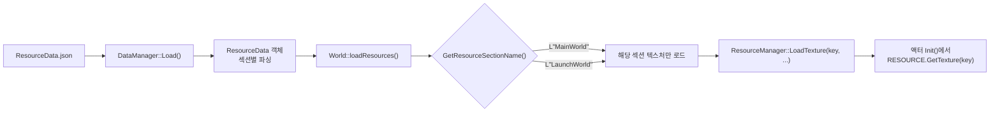

- 각 `World`는 `GetResourceSectionName()`을 오버라이드해서 **자기 섹션만** 로드한다.
- 사운드는 씬 구분 없이 전부 미리 로드한다 — `SOUND.Play(key)`가 어느 씬에서든 즉시
  동작해야 하므로. `LoadSound`는 이미 로드된 키를 무시하므로 중복 호출이 안전하다.
- `loadResources()`는 `World::Enter()` **맨 처음**에 호출된다. 그 아래에서 스폰되는
  액터들의 `Init()`이 `GetTexture()`로 바로 꺼내 쓸 수 있어야 하기 때문.

### 6.2 텍스처 렌더링 — 투명키와 회전

```cpp
if (_transparent == -1)  ::StretchBlt(...);        // 투명키 없음
else                     ::TransparentBlt(...);    // 마젠타(255,0,255) 등을 투명 처리
```

**회전 렌더링(`RenderRotated`)** 은 GDI `PlgBlt`(평행사변형 블릿)를 쓴다. 문제는 `PlgBlt`가
투명키를 지원하지 않는다는 것 — 그래서 2단 구조를 만들었다.

```
① 임시 버퍼를 투명키 색으로 가득 채움
       ┌─────────────┐
       │ ▒▒▒▒▒▒▒▒▒▒▒ │  ▒ = 투명키(마젠타)
       │ ▒▒▒▒▒▒▒▒▒▒▒ │
       └─────────────┘
② PlgBlt로 원본을 회전시켜 임시 버퍼 정중앙에 찍음
       ┌─────────────┐
       │ ▒▒▒╱▔▔╲▒▒▒▒ │
       │ ▒▒▕ 🚀 ▏▒▒▒ │
       └─────────────┘
③ TransparentBlt로 임시 버퍼 전체를 최종 화면에 (투명키 제거하며) 합성
```

버퍼는 `_tempDim` 크기로 **캐싱**한다(매 호출 생성/파괴하면 심각하게 느려짐). 캐시된
버퍼가 이번 호출에 필요한 크기보다 크면 재사용하는데, 여기에 실제로 버그가 있었다 —
"필요한 크기(`maxDim`)"와 "실제 버퍼 크기(`_tempDim`)"를 섞어 쓰면 버퍼 일부만 지워지고
중심이 어긋나 **이전 프레임 잔상이 함께 블릿**된다. 지금은 `maxDim`을 "키울지 판단"에만
쓰고, 채우기·중심 계산은 전부 `_tempDim` 기준으로 통일했다.

```cpp
int32 maxDim = (int32)sqrt(destSize.x² + destSize.y²) + 4;   // 회전해도 안 잘리는 대각선
if (not _tempDC or maxDim > _tempDim) { /* 재생성 */ _tempDim = maxDim; }

RECT r = { 0, 0, _tempDim, _tempDim };   // ★ maxDim 아님
::FillRect(_tempDC, &r, bgBrush);
float tempHalf = _tempDim / 2.f;         // ★ 중심도 _tempDim 기준
```

### 6.3 입력

`GetKeyboardState`로 256키 상태를 한 번에 받아, 이전 프레임 상태와 비교해
`None → Down → Press → Up` 4상태 머신으로 변환한다.

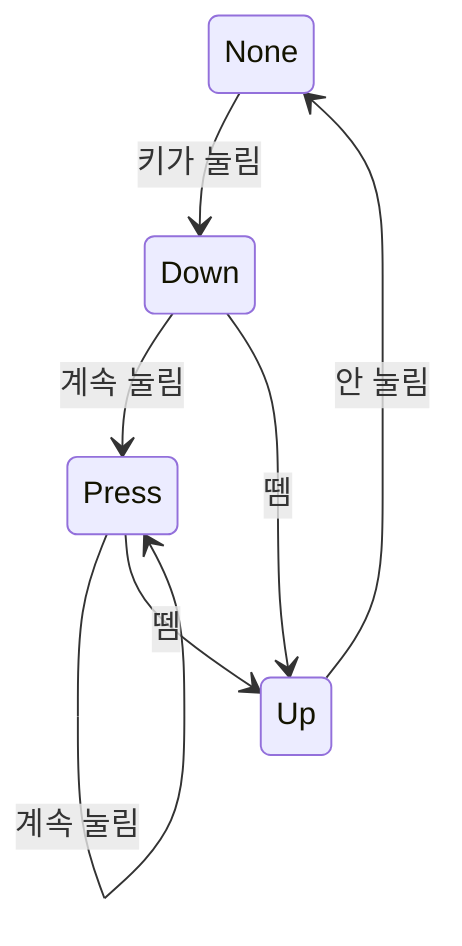

`Down`(그 프레임에 처음 눌림)과 `Press`(눌린 채 유지)를 구분하는 게 핵심 — 회전 입력은
`Press`(연속), 씬 전환·모드 토글은 `Down`(1회)을 쓴다.

### 6.4 사운드

DirectSound 기반. `Sound` 클래스가 `mmio*` API로 WAV를 직접 파싱해 세컨더리 버퍼에
올린다. `SoundManager::Play(key, loop)` / `SetVolume(key, ratio)` 형태로 사용한다.
씬별로 BGM(`S_Space`)과 상태 SFX(`S_Spaceship`, `S_BlackHole`)가 선택 상태에 따라
켜지고 꺼진다.

---

# Part II. 수학과 물리

## 7. 좌표계와 행렬 카메라

### 7.1 좌표계 규약

```
  월드 좌표 (y-down, GDI 관례를 그대로 사용)

        -y  (위 / 고도 증가 방향)
         ▲
         │
  -x ────┼──── +x
         │
         ▼
        +y  (아래 / LaunchWorld의 지면 방향)

  · LaunchWorld : 지면 y=0, 고도 = -pos.y
  · MainWorld   : 태양계 평면 = XY, 은하 진행축 = 가상의 Z (§7.7)
  · 각도 0도    : 정면 = (0,-1) = 화면 위쪽,  시계 방향이 +
```

`y`가 아래로 증가하는 것은 GDI 화면 좌표계와 동일해서 렌더링 시 부호 변환이 필요 없다.
대신 "고도"는 `-pos.y`로 읽는다는 규칙을 물리·UI 전반에서 일관되게 적용했다.

### 7.2 뷰 행렬 유도

3×3 동차좌표 열벡터 규약(`p' = M·p`, `p = (x, y, 1)ᵀ`)을 쓴다.

$$
\text{View} = T(\mathbf{h} + \mathbf{s}) \cdot S(z) \cdot R(\theta) \cdot T(-\mathbf{p})
$$

| 기호 | 의미 |
|---|---|
| $\mathbf{p}$ | 카메라 월드 위치 (`_position`) |
| $\theta$ | 카메라 회전 (`_rotation + _manualRotation`) |
| $z$ | 줌 배율 (`_zoom`) |
| $\mathbf{h}$ | 화면 절반 (`_half`) |
| $\mathbf{s}$ | 쉐이크 오프셋 (`_shakeOffset`) |

**오른쪽부터 읽으면 변환 순서가 그대로 나온다.**

```
월드의 한 점 p
   │
   │  T(-position)   카메라를 원점으로 가져오는 만큼 세상을 반대로 민다
   ▼
카메라 기준 좌표
   │
   │  R(θ)           카메라 회전만큼 세상을 반대로 돌린다
   ▼
회전 정렬된 좌표
   │
   │  S(zoom)        배율 적용
   ▼
스케일된 좌표
   │
   │  T(half+shake)  화면 중앙으로 옮긴다 (+ 흔들림)
   ▼
스크린 좌표
```

```cpp
void Camera::UpdateViewMatrix()
{
    _view = _view.Translate(_half + _shakeOffset) *
            _view.Scale(_zoom) *
            _view.Rotate(_rotation + _manualRotation) *
            _view.Translate(-_position);
    _invView = _view.Inverse();
}
```

`Matrix3x3`의 곱셈은 삼중 루프로 직접 구현했다.

```cpp
for (int i = 0; i < 3; ++i)
  for (int j = 0; j < 3; ++j)
    for (int k = 0; k < 3; ++k)
      mat.m[i][j] += m[i][k] * M.m[k][j];
```

### 7.3 점 변환 vs 벡터 변환

```cpp
Vector2 TransformPoint (const Vector2& p) const   // (x, y, 1)ᵀ → 이동 성분 O
{ return { m[0][0]*p.x + m[0][1]*p.y + m[0][2], m[1][0]*p.x + m[1][1]*p.y + m[1][2] }; }

Vector2 TransformVector(const Vector2& v) const   // (x, y, 0)ᵀ → 이동 성분 X
{ return { m[0][0]*v.x + m[0][1]*v.y, m[1][0]*v.x + m[1][1]*v.y }; }
```

동차좌표의 세 번째 성분이 1이냐 0이냐로 "위치"와 "방향"을 구분한다. 방향 벡터(속도 등)를
`TransformPoint`로 변환하면 카메라 위치만큼 엉뚱하게 밀리는 전형적인 버그가 된다.
역행렬 계산에서 이동 성분을 되돌릴 때 `TransformVector`를 쓰는 것도 같은 이유.

### 7.4 역행렬 3종 — "왜 아핀 전용으로 충분한가"의 증명

| 구현 | 방식 | 비용 | 용도 |
|---|---|---|---|
| `Inverse()` | 아핀 전용 (2×2 역행렬 + 이동 성분 역변환) | 나눗셈 1회 | **실사용** |
| `InverseAdjugate()` | 여인수 전개 / 수반행렬 | 3×3 행렬식 + 9개 여인수 | 검산 |
| `InverseGaussJordan()` | 가우스-조던 소거법 (부분 피벗) | 증강행렬 3×6 소거 | 검산 |

뷰 행렬은 `T·S·R·T` 조합이므로 **항상 아핀**이다(3행이 언제나 `[0 0 1]`). 따라서
일반 3×3 역행렬을 계산할 필요가 없다.

$$
M = \begin{bmatrix} A & \mathbf{t} \\ \mathbf{0}^T & 1 \end{bmatrix}
\quad\Longrightarrow\quad
M^{-1} = \begin{bmatrix} A^{-1} & -A^{-1}\mathbf{t} \\ \mathbf{0}^T & 1 \end{bmatrix}
$$

```cpp
Matrix3x3 Inverse() const
{
    float det = A[0][0]*A[1][1] - A[0][1]*A[1][0];
    if (abs(det) < SMALL_NUMBER) return ZeroMatrix();

    invA.m[0][0] =  A[1][1]/det;  invA.m[0][1] = -A[0][1]/det;
    invA.m[1][0] = -A[1][0]/det;  invA.m[1][1] =  A[0][0]/det;

    Vector2 invAt = -invA.TransformVector(t);   // -A⁻¹t
    // ... 조립
}
```

세 구현을 나란히 두고 같은 행렬에 대해 결과가 일치하는지 확인해서, "아핀 전용이 충분하다"를
말이 아니라 코드로 증명해두었다. 특이행렬(det≈0)은 세 구현 모두 영행렬을 반환한다.

### 7.5 클릭 피킹

```cpp
Vector2 Camera::WorldToMousePos(Vector2 mousePos)
{
    return ScreenToWorld(mousePos / GAME.GetRectRatio());   // ① 레터박스 역보정
}                                                           // ② 역행렬 변환

// MainWorld::Update()
Vector2 worldPos = _camera.WorldToMousePos(mousePos);
if (AActor* picked = PickActor(worldPos)) SelectActor(picked);
else                                      DeselectActor();
```

```cpp
AActor* World::PickActor(Vector2 worldPos) const
{
    for (AActor* actor : _actors)
    {
        UColliderComponent* col = actor->GetCollider();
        if (!col || col->GetColliderType() != ColliderType::Circle) continue;
        if ((worldPos - actor->GetCenterPos()).Length() <= col->GetRadius())
            return actor;
    }
    return nullptr;
}
```

피킹은 **월드 공간에서** 판정한다. 화면 공간에서 하면 줌 배율마다 히트 영역이 달라지는데,
월드에서 하면 "행성 반지름 안을 클릭했는가"라는 물리적 의미가 그대로 유지된다.

클릭 우선순위: ImGui 캡처 → 자체 UI 호버 → 게임 뷰포트 내부 → 액터 피킹 → 빈 공간(해제).

```cpp
bool overOwnUI = _widget and _widget->IsMouseOverUI(mousePos);
if (_INPUT.IsMouseInsideWindow(GAME.GetGameViewportRect())
    and not io.WantCaptureMouse and not overOwnUI) { /* 피킹 */ }
```

### 7.6 보간 — 세 값에 서로 다른 보간을 쓰는 이유

```cpp
float a = std::exp(-_followK * deltaTime);            // 프레임레이트 독립 지수감쇠 계수
_position = Vector2::Lerp(_position, _targetPosition, 1.f - a);   // 위치: 선형
_rotation = LerpAngle(_rotation, _targetRotation, 1.f - a);       // 각도: 최단경로
_zoom    *= std::pow(_targetZoom / _zoom, 1.f - a);               // 줌: 로그(기하) 보간
```

**① 지수감쇠 계수 `exp(-k·dt)`** — 단순히 `lerp(a, b, 0.1f)`로 하면 프레임레이트가
바뀔 때 추적 속도가 달라진다. `exp(-k·dt)`를 쓰면 dt가 어떻든 **같은 실시간에 같은 만큼**
수렴한다.

**② 줌은 왜 로그인가** — 사람이 체감하는 배율은 덧셈이 아니라 곱셈이다. 1배→2배와
2배→4배는 "같은 정도의 변화"로 느껴진다. 선형 보간하면 줌아웃 초반이 급격하고 후반이
답답해진다. 기하 보간(`z *= (target/z)^t`)은 로그 공간에서 선형이라 전 구간이 균일하게
느껴진다.

```
   선형 보간                        로그(기하) 보간
   z: 1 ────────────► 100          z: 1 ─► 3.2 ─► 10 ─► 32 ─► 100
      ▲ 초반 체감이 폭발적             ▲ 전 구간 체감 균일
        (0→50에서 이미 반 이상)
```

**③ 각도는 왜 최단경로인가**

```cpp
float LerpAngle(float from, float to, float t)
{
    float delta = to - from;
    delta = atan2f(sinf(delta), cosf(delta));   // ±π 안으로 접는다
    return from + delta * t;
}
```

350° → 10°를 선형 보간하면 `delta = -340°`가 되어 **반대 방향으로 한 바퀴 크게** 돈다.
`atan2(sin Δ, cos Δ)`로 접으면 `+20°`가 되어 최단 경로로 간다.

### 7.7 줌 앵커링 (마우스 고정 줌)

```
줌 전                          줌 후 (보정 없음)         줌 후 (보정 적용)
┌──────────┐                  ┌──────────┐             ┌──────────┐
│    🌍    │                  │  🌍      │             │    🌍    │
│     ✛    │  ✛ = 마우스       │   ✛      │             │     ✛    │
└──────────┘                  └──────────┘             └──────────┘
                              지구가 마우스에서          마우스가 가리키던
                              벗어남                    지점이 그대로 유지
```

```cpp
Vector2 before = WorldToMousePos(_INPUT.GetMousePos());  // 줌 적용 전 월드 좌표

_zoom *= std::pow(_targetZoom / _zoom, 1.f - a);

UpdateViewMatrix();                                       // ★ 먼저 갱신해야
Vector2 after = WorldToMousePos(_INPUT.GetMousePos());    //   바뀐 줌 기준 값이 나옴

_position += (before - after);                            // ★ 대입이 아니라 '차이만큼'
```

두 군데가 함정이다 — (a) `_view` 갱신 전에 `after`를 구하면 `before == after`가 되어
보정이 0이 된다. (b) `_position = before - after`처럼 대입하면 카메라가 원점 근처로
튄다. 반드시 누적(`+=`)이어야 한다.

줌아웃에는 앵커링을 적용하지 않는다(`if (zoomingIn)`) — 줌아웃은 "전체를 보고 싶다"는
의도라 중심 유지가 더 자연스럽다는 판단.

### 7.8 사이드뷰 투영과 은하 드리프트

태양계 전체가 은하 진행 방향(가상의 Z축)으로 초당 300유닛씩 흐른다. 톱뷰에서는 보이지
않지만, `V` 키로 사이드뷰를 켜면 **(Z, Y) 평면**으로 투영해 그 흐름을 볼 수 있다.

```cpp
Vector2 Camera::WorldToScreenAtZ(Vector2 worldPos, float z)
{
    Vector2 projected = _isSideView ? Vector2(z, worldPos.y) : worldPos;
    return _view.TransformPoint(projected);
}
Vector2 WorldToScreenSolar(Vector2 worldPos) { return WorldToScreenAtZ(worldPos, _galacticZ); }
```

```
 톱뷰 (기본)                          사이드뷰 (V키)
    y                                     y
    ▲   ○ 화성                            ▲
    │ ○   ☀    ○ 지구                     │  ∿∿∿∿∿∿∿  ← 행성 궤적이 나선으로
    │      ○ 금성                          │ ∿∿∿∿∿∿∿∿    (공전 + Z 진행)
    └────────────► x                       └────────────► z (은하 진행축)
    (X-Y 평면)                             (Z-Y 평면)
```

행성 궤도 점선을 사이드뷰에서 제대로 그리려면 "각 위상에 도달하는 **시간차**"가 필요하다.
그래서 `GetOrbitShapeTimed()`는 위치뿐 아니라 시간 오프셋도 함께 반환한다.

```cpp
vector<OrbitShapePoint> APlanet::GetOrbitShapeTimed(int steps) const
{
    for (int i = 0; i <= steps; ++i)
    {
        float M = (2π * i) / steps;                 // E가 아니라 M을 훑는다 (M이 시간과 선형)
        float E = SolveKeplerEquation(M, _eccentricity);

        float dM = M - _meanAnomaly;
        while (dM >  π) dM -= 2π;                   // 가장 가까운 과거/미래로 wrap
        while (dM < -π) dM += 2π;

        float t = (_orbitSpeed != 0.f) ? (dM / _orbitSpeed) : 0.f;
        points.push_back({ ComputePositionAtEccentricAnomaly(E), t });
    }
}

// MainWorld::Render()
float z = _camera.GetGalacticZ() + _galacticDriftSpeed * pt.timeOffset;
Vector2 s = _camera.WorldToScreenAtZ(pt.pos, z);
```

`GetOrbitShape()`(모양만 필요할 때)는 케플러 방정식을 풀지 않고 편심근점이각 `E`를 직접
등간격으로 훑는다 — **모양만 필요하면 뉴턴법 6회 반복을 통째로 생략**할 수 있다는
최적화. 반대로 `GetOrbitShapeTimed()`는 시간 정보가 필요하므로 반드시 `M`을 훑고
케플러 방정식을 풀어야 한다. 같은 타원을 그리는 두 함수의 비용이 다른 이유다.

### 7.9 카메라 쉐이크

```cpp
void Camera::UpdateShake(float deltaTime)
{
    _shakeTimer -= deltaTime;
    float ratio = max(_shakeTimer / _shakeDuration, 0.f);   // 1 → 0 선형 감쇠
    float angle = (rand() % 360) * (π / 180.f);
    _shakeOffset = Vector2(cosf(angle), sinf(angle)) * (_shakeMagnitude * ratio);
}
```

쉐이크는 뷰 행렬의 이동 성분에 더해지므로(`T(_half + _shakeOffset)`), 게임 로직·물리는
전혀 영향받지 않고 화면만 흔들린다. 발사 시 `LaunchWorld`가 **대기 밀도에 비례해** 세기를
넣는다 — 저고도에서 세고, 고도가 오를수록 자연히 잦아든다.

```cpp
if (_ship->GetIsThrusting())
    _camera.AddShake(0.1f, 1.f * density);   // density = exp(-altitude / 2500)
```

---

## 8. 물리 엔진 — 수치적분

### 8.1 고정 타임스텝 누적기

```
프레임 dt = 0.0083s (120fps), FIXED_DT = 1/240 = 0.00417s

 frame N      ┌──── dt = 0.0083 ────┐
 accumulator  │ ▓▓▓▓▓▓▓▓▓▓▓▓▓▓▓▓▓▓ │ + 이전 잔여
              └──┬────────┬─────┬───┘
   substep 1 ────┘        │     │        각 스텝은 정확히 1/240초
   substep 2 ─────────────┘     │
   잔여(0.0000..) ──────────────┘ → 다음 프레임으로 이월
```

```cpp
void UPhysicsComponent::Update(float deltaTime)
{
    if (_isPaused) return;
    _accumulator += deltaTime;
    float timeOffset = -_accumulator;      // §12에서 설명

    int steps = 0;
    while (_accumulator >= FIXED_DT && steps < MAX_STEPS)
    {
        PhysicsStep(FIXED_DT, timeOffset);
        timeOffset += FIXED_DT;
        _accumulator -= FIXED_DT;
        ++steps;
    }
    if (steps >= MAX_STEPS) _accumulator = 0.f;   // 밀린 시간은 버린다
}
```

**왜 필요한가** — 물리 적분의 오차는 스텝 크기에 의존한다. 프레임 dt를 그대로 쓰면
"60fps에서는 궤도가 안정적인데 30fps에서는 발산"하는 **프레임레이트 의존 물리**가 된다.
스텝 크기를 240Hz로 고정하면 결과가 프레임레이트와 무관해진다.

| 상수 | 값 | 근거 |
|---|---|---|
| `FIXED_DT` | 1/240초 | 120fps에서 프레임당 2스텝 — 정확도와 비용의 균형 |
| `MAX_STEPS` | 3000 | 12.5초 분량. 100배속 최악 케이스(0.1×100=10초 → 2400스텝) 대비 여유 |

> `MAX_STEPS`는 원래 5 → 25 → 3000으로 두 번 올렸다. 두 번 다 "한 프레임이 소화해야 할
> 시간"이 예상보다 커진 사건 때문이었다(Debug 빌드 저프레임 / 시간배속). §12 참고.

### 8.2 적분기 3종

`EIntergrator` enum으로 런타임 전환 가능하게 구현했다. 우주선 궤적 색으로 어느 적분기가
동작 중인지 구분된다(빨강=명시적, 초록=반암시적, 파랑=RK4).

**① 명시적 오일러 — 위치 먼저**

$$x_{n+1} = x_n + v_n \Delta t, \qquad v_{n+1} = v_n + a(x_n) \Delta t$$

```cpp
Vector2 newPos = oldPos + oldVel * deltaTime;
Vector2 newVel = oldVel + ComputeAcceleration(oldPos, oldVel, timeOffset) * deltaTime;
```

**② 반암시적(심플렉틱) 오일러 — 속도 먼저**

$$v_{n+1} = v_n + a(x_n)\Delta t, \qquad x_{n+1} = x_n + v_{n+1} \Delta t$$

```cpp
_velocity += ComputeAcceleration(GetOwner()->GetCenterPos(), _velocity, timeOffset) * deltaTime;
GetOwner()->SetCenterPos(GetOwner()->GetCenterPos() + _velocity * deltaTime);
```

**③ RK4 — 네 지점 기울기의 가중평균**

$$
x_{n+1} = x_n + \frac{\Delta t}{6}(k_1^x + 2k_2^x + 2k_3^x + k_4^x)
$$

```cpp
Vector2 a1 = ComputeAcceleration(x0, v0, timeOffset);
Vector2 k1_x = v0,   k1_v = a1;                                  // 시작점

Vector2 x_k2 = x0 + k1_x * (dt*0.5f), v_k2 = v0 + k1_v * (dt*0.5f);
Vector2 k2_x = v_k2, k2_v = ComputeAcceleration(x_k2, v_k2, timeOffset);   // 중점 1차

Vector2 x_k3 = x0 + k2_x * (dt*0.5f), v_k3 = v0 + k2_v * (dt*0.5f);
Vector2 k3_x = v_k3, k3_v = ComputeAcceleration(x_k3, v_k3, timeOffset);   // 중점 2차

Vector2 x_k4 = x0 + k3_x * dt,        v_k4 = v0 + k3_v * dt;
Vector2 k4_x = v_k4, k4_v = ComputeAcceleration(x_k4, v_k4, timeOffset);   // 끝점

newPos = x0 + (k1_x + 2*k2_x + 2*k3_x + k4_x) * (dt/6.f);
newVel = v0 + (k1_v + 2*k2_v + 2*k3_v + k4_v) * (dt/6.f);
```

### 8.3 세 적분기의 장기 거동 비교

```
    총 역학적 에너지 E = v²/2 - μ/r  의 시간 변화

  E  ▲
     │         ╱ 명시적 오일러 — 단조 증가 → 궤도가 나선형으로 발산
     │       ╱
   0 ├─────╳──────────────────────  ← RK4: 매우 느리게 드리프트
     │   ╱   ∿∿∿∿∿∿∿∿∿∿∿∿∿∿∿∿∿∿∿  ← 반암시적: 진동만, 누적 드리프트 없음
     │ ╱
     └──────────────────────────────► t
```

| 적분기 | 국소 오차 | 장기 에너지 | 스텝당 가속도 평가 |
|---|---|---|---|
| 명시적 오일러 | $O(\Delta t^2)$ | **단조 증가 → 발산** | 1회 |
| 반암시적 오일러 | $O(\Delta t^2)$ | **유계 진동 (심플렉틱)** | 1회 |
| RK4 | $O(\Delta t^5)$ | 매우 느린 드리프트 | **4회** |

**현재 기본값은 RK4**(`_integrator = EIntergrator::RK4`). `FIXED_DT`가 240Hz로 충분히
잘게 쪼개져 있어 4배 비용을 감당할 수 있는 규모였고, 짧은 구간의 궤도 예측 정확도가
게임플레이(전이 예측선, 근지점 표시)에 직접 드러나기 때문이다. 반암시적 오일러를 함께
남겨둔 이유는 **심플렉틱 적분기의 에너지 보존 특성을 직접 비교·증명**하기 위함 —
"왜 궤도 게임에서 4차 정확도보다 심플렉틱 성질을 더 따지는가"를 코드로 보여줄 수 있다.

### 8.4 가속도 모델 — Patched-Conic

진짜 N-body가 아니다. **그 순간 우주선을 지배하는 천체 하나만** 당긴다.

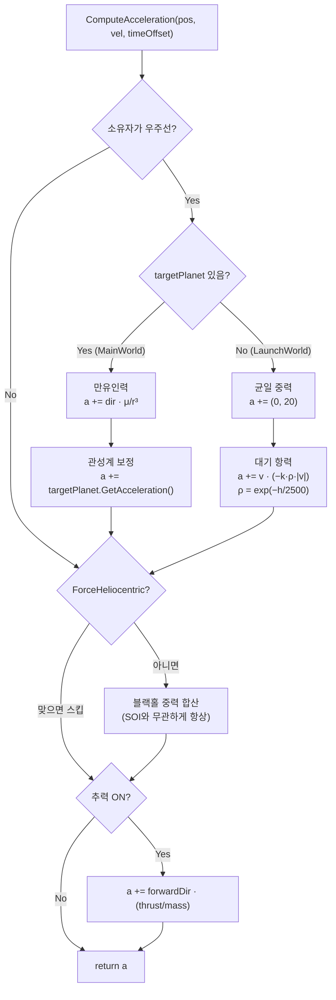

```cpp
if (targetPlanet)
{
    Vector2 targetPos = targetPlanet->GetFuturePos(targetTimeOffset);
    Vector2 dir = targetPlanet->GetCenterPos() - pos;
    float r2 = dir.LengthSquared();
    float r  = max(sqrtf(r2), targetPlanet->GetBodyRadius());   // r→0 클램프 (NaN 방지)
    r2 = r * r;

    a += dir * (targetPlanet->GetMu() / (r2 * r));   // a = μ·dir/r³ = (μ/r²)·(dir/r)
    a += targetPlanet->GetAcceleration();            // 관성계 보정 (§9.5)
}
```

> ⚠️ **현재 코드의 미완결 지점 (실제 확인됨)**
> 위 블록에서 `targetPos`를 계산해놓고 정작 `dir`은 `GetCenterPos()`로 만들고 있다.
> 즉 `targetPos`는 **미사용 변수**이고, §12.2에서 설명하는 "서브스텝 타겟 위치 보정"이
> 현재는 **실질적으로 적용되지 않은 상태**다. `timeOffset` 배관(`Update` →
> `PhysicsStep` → `ComputeAcceleration`)은 전부 연결돼 있으므로,
> `Vector2 dir = targetPos - pos;` 한 줄로 바꾸면 의도한 동작이 된다.

`r`을 행성 반지름으로 클램프하는 건 중요한 방어다 — `r → 0`이면 `μ/r³ → ∞`가 되어
속도가 NaN이 되고, 한 번 NaN이 되면 이후 모든 프레임이 오염된다.

### 8.5 발사 물리 (LaunchWorld)

```cpp
a += Vector2(0.f, 20.f);                              // 균일 중력 (아래 = +y)

float altitude = -pos.y;
float density  = expf(-altitude / GAtmosphereScaleHeight);   // 지수 대기 모델
float speed    = vel.Length();
constexpr float kDragCoeff = 0.003f;
a += vel * (-kDragCoeff * density * speed);           // F ∝ v², 방향은 속도 반대
```

**대기 항력** $\;\mathbf{a}_{drag} = -k\,\rho(h)\,|\mathbf{v}|\,\mathbf{v}$

`vel * (-k·ρ·speed)`는 크기로는 $v^2$에 비례하고 방향은 속도 반대다. 공기저항의 표준
형태를 벡터 한 줄로 표현했다.

**대기 밀도** $\;\rho(h) = e^{-h/H}$, `H = GAtmosphereScaleHeight = 2500`

이 값 하나가 **네 가지를 동시에 구동**한다 — 항력 세기, 하늘색(레일리 산란), 별 밝기,
카메라 줌아웃. 원래 기획 의도였던 "고도 하나가 여러 표현을 동시에 몰고 간다"를
공유 상수 하나로 구현했다.

```
고도 h  ──► density = e^(-h/2500) ──┬──► 항력 (ComputeAcceleration)
                                    ├──► 하늘색 (ComputeRayleighSkyColor)
                                    ├──► 별 밝기 (StarField::Render(1-density))
                                    ├──► 구름 농도 (RenderCloud intensity)
                                    └──► 카메라 줌 (0.3 + 1.7·density)
```

**추력 대비 중력비 (TWR)** — `_thrust = 25`, 중력 `20` → TWR = 1.25.
(코드 주석에는 1.75로 적혀 있는데, 중력값이 조정되면서 주석만 남은 것으로 보인다.)
TWR > 1이어야 제자리에서 뜰 수 있고, 1.25는 "겨우 뜨는" 긴장감 있는 값이다.

**자동 조종 — 중력 선회(Gravity Turn)**

```cpp
if      (altitude < 800)  _autoTargetDegree = 0.f;                  // 수직 상승
else if (altitude < 1000) _autoTargetDegree = kInitialKickDegree;   // 3도 킥
else _autoTargetDegree = clamp(RadianToDegree(atan2f(vel.x, -vel.y)), 0.f, 15.f);
                                             // ↑ 속도 벡터 방향을 따라감 = 받음각 0
```

3단계 구조가 실제 로켓의 중력 선회를 그대로 흉내낸다 — ① 최대 동압 구간을 수직으로
통과, ② 살짝 기울여 중력이 기수를 눕히도록 유도(킥), ③ 이후엔 **속도 벡터 방향을 따라감**
(받음각을 0으로 유지해 공력 하중을 없앰).

목표각으로 회전할 때도 각도 wrap을 처리한다.

```cpp
float diff = _autoTargetDegree - GetDegree();
diff = fmodf(diff + 180.f, 360.f);
if (diff < 0.f) diff += 360.f;
diff -= 180.f;                                       // -180 ~ +180으로 접기
AddRotation(clamp(diff, -maxStep, maxStep));         // 프레임당 회전 상한
```

---

## 9. 궤도역학 엔진

### 9.1 행성은 적분하지 않는다

행성은 힘을 적분해 움직이지 않는다. **평균근점이각(Mean Anomaly)을 각속도만큼 전진시키고,
그 시점의 위치를 닫힌 수식(closed-form)으로 계산**한다.

```cpp
void APlanet::Update(float deltaTime)
{
    _meanAnomaly += _orbitSpeed * deltaTime;                    // M = M₀ + n·t
    SetCenterPos(ComputePositionAtMeanAnomaly(_meanAnomaly));
    Super::Update(deltaTime);
}
```

| 방식 | 오차 | 시간 역행 | 비용 |
|---|---|---|---|
| 수치적분 | 스텝마다 누적 | 불가 (되감기 필요) | 스텝 비례 |
| **폐형해 (채택)** | **누적 없음** | **가능 (t<0 대입)** | 상수 |

이 선택 하나가 프로젝트 전체를 떠받친다 — 100배속으로 몇 시간을 돌려도 궤도가 흐트러지지
않고, `GetFuturePos(t)`로 **미래·과거 위치를 오차 없이 즉시** 구할 수 있다.
이 능력이 §10(전이 계획)·§12(배속 보정)의 전제가 된다.

### 9.2 궤도 요소

```
                     원일점(apoapsis)              장반경 a = (r_peri + r_apo)/2
                          ●                        이심률  e = (r_apo - r_peri)/(r_apo + r_peri)
                    ╱           ╲                  각속도  n = 2π / T (평균 운동)
                 ╱                 ╲
               │      ☀ ← 초점       │   ← 행성이 이 타원 위를 돈다
                 ╲    (orbitCenter)╱
                    ╲           ╱
                          ●
                     근일점(periapsis)
                     ← ω (argPeriapsis): 근일점이 어느 방향인지
```

| 필드 | 기호 | 의미 |
|---|---|---|
| `_semiMajorAxis` | $a$ | 장반경 |
| `_eccentricity` | $e$ | 이심률 (0=원) |
| `_orbitSpeed` | $n$ | 평균 운동(각속도, rad/s) |
| `_argPeriapsis` | $\omega$ | 근일점 편각 |
| `_meanAnomaly` | $M$ | 평균근점이각 (시간과 **선형**) |
| `_orbitCenter` | — | 초점의 월드 좌표 |
| `_orbitCenterBody` | — | 초점이 **따라다니는 천체** (§9.5) |

### 9.3 M → E → ν 변환 체인

세 가지 "이각(anomaly)"을 거쳐야 위치가 나온다.

```
 M (평균근점이각)   시간과 선형. 물리적 위치는 아님.
      │
      │  케플러 방정식  M = E − e·sin E      ← 초월방정식! 닫힌 해 없음
      │  → 뉴턴-랩슨 6회 반복
      ▼
 E (편심근점이각)   외접원 위의 각도
      │
      │  ν = 2·atan2( √(1+e)·sin(E/2), √(1−e)·cos(E/2) )
      ▼
 ν (진근점이각)    초점에서 실제로 바라본 각도
      │
      │  r = a(1 − e·cos E)
      ▼
 위치 = orbitCenter + (cos(ν+ω), sin(ν+ω)) · r
```

```cpp
float SolveKeplerEquation(float meanAnomaly, float eccentricity)
{
    // 뉴턴법: f(E) = E − e·sinE − M,  f'(E) = 1 − e·cosE
    // 이심률이 게임 내 최대(수성 0.206) 범위면 6회로 충분히 수렴한다.
    float E = meanAnomaly;
    for (int i = 0; i < 6; i++)
    {
        float dE = (E - eccentricity * sinf(E) - meanAnomaly) / (1.f - eccentricity * cosf(E));
        E -= dE;
    }
    return E;
}
```

반복 횟수를 수렴 판정 없이 **6회로 고정**한 건 의도적이다 — 분기 없는 고정 루프가
캐시·분기예측에 유리하고, 이 이심률 범위에서 6회면 부동소수점 정밀도 한계까지 수렴한다.
"수렴할 때까지"보다 "확실히 충분한 횟수"가 실시간 시스템에 적합하다는 판단.

```cpp
Vector2 APlanet::ComputePositionAtEccentricAnomaly(float E) const
{
    float nu = 2.f * atan2f(sqrtf(1.f + _eccentricity) * sinf(E * 0.5f),
                            sqrtf(1.f - _eccentricity) * cosf(E * 0.5f));
    float r  = _semiMajorAxis * (1.f - _eccentricity * cosf(E));
    return _orbitCenter + Vector2(cosf(nu + _argPeriapsis), sinf(nu + _argPeriapsis)) * r;
}
```

`atan2`의 **반각 공식**을 쓰는 이유: `tan(ν/2) = √((1+e)/(1-e))·tan(E/2)`를 `atan`으로
풀면 사분면 정보가 사라져 궤도 반대편에서 위치가 튄다. `atan2`는 두 인자의 부호로
사분면을 그대로 살린다.

### 9.4 속도의 폐형해

```cpp
Vector2 APlanet::ComputeVelocityAtEccentricAnomaly(float E) const
{
    float r = _semiMajorAxis * (1.f - _eccentricity * cosf(E));

    float factor = (_orbitSpeed * _semiMajorAxis * _semiMajorAxis) / r;   // n·a²/r
    float vx_pf  = -factor * sinf(E);
    float vy_pf  =  factor * sqrtf(1.f - _eccentricity * _eccentricity) * cosf(E);

    float c = cosf(_argPeriapsis), s = sinf(_argPeriapsis);
    return Vector2(vx_pf * c - vy_pf * s, vx_pf * s + vy_pf * c);   // 근점기준 → 월드 회전
}
```

**유도** — 근점기준(perifocal) 좌표계에서 속도는

$$\dot{\mathbf{r}} = \frac{\sqrt{\mu a}}{r}\left(-\sin E,\; \sqrt{1-e^2}\cos E\right)$$

케플러 3법칙 $\mu = n^2 a^3$을 대입하면 $\sqrt{\mu a} = \sqrt{n^2 a^4} = n a^2$.
코드의 `factor = n·a²/r`가 정확히 이것이다. **μ를 몰라도 n과 a만으로 속도가 나온다**는 게
포인트 — 행성은 자기 부모의 μ를 알 필요가 없다.

마지막 2×2 회전은 근점기준 좌표를 월드로 옮기는 변환($R(\omega)$).

### 9.5 `_orbitCenterBody` 체이닝 — 이 프로젝트의 핵심 구조

행성의 공전 중심은 고정점이 아니라 **자기도 움직이는 다른 천체**일 수 있다.

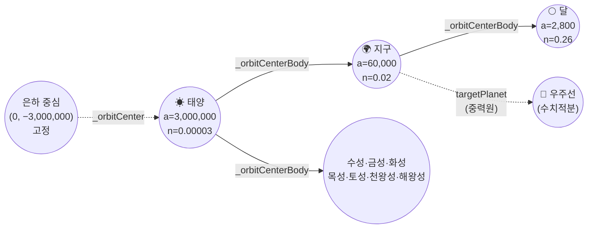

**재귀 누적**

```cpp
Vector2 APlanet::GetVelocity() const
{
    float E = SolveKeplerEquation(_meanAnomaly, _eccentricity);
    Vector2 relativeVel = ComputeVelocityAtEccentricAnomaly(E);   // 부모 기준 상대속도
    if (_orbitCenterBody)
        relativeVel += _orbitCenterBody->GetVelocity();           // ★ 부모의 속도까지 재귀 누적
    return relativeVel;
}

Vector2 APlanet::GetAcceleration() const
{
    Vector2 toCenter = _orbitCenter - GetCenterPos();
    float r2 = toCenter.LengthSquared(), r = sqrtf(r2);
    if (r < 0.001f) return Vector2();

    // μ_eff = n²a³ — 케플러 3법칙 역산. 부모의 μ를 몰라도 자기 궤도 요소만으로 구한다.
    // (원운동 근사 ω²·(center−pos)보다 정확: 타원 궤도에서도 진짜 뉴턴 중력이 된다)
    float muEff = _orbitSpeed * _orbitSpeed * _semiMajorAxis * _semiMajorAxis * _semiMajorAxis;
    Vector2 accel = toCenter * (muEff / (r2 * r));

    if (_orbitCenterBody)
        accel += _orbitCenterBody->GetAcceleration();             // ★ 재귀 누적
    return accel;
}
```

**전개하면**

$$
\mathbf{v}_{moon}^{world} = \underbrace{\mathbf{v}_{moon/earth}}_{\text{달의 폐형해}} + \underbrace{\mathbf{v}_{earth/sun}}_{\text{지구의 폐형해}} + \underbrace{\mathbf{v}_{sun/galaxy}}_{\text{태양의 폐형해}}
$$

**매 프레임 중심 좌표 동기화**는 한 줄로 통일했다.

```cpp
void RefreshOrbitCenter() { if (_orbitCenterBody) _orbitCenter = _orbitCenterBody->GetCenterPos(); }

// MainWorld::Update() 맨 앞
for (auto planet : _planets) planet->RefreshOrbitCenter();
```

원래는 "태양 좌표를 모든 행성에 다시 꽂아주는" 태양 전용 루프였다. 이걸 일반화한 덕분에
**달 기능 구현이 사실상 파라미터 세팅만으로 끝났다.**

```cpp
APlanet* moon = SpawnActor<APlanet>();
moon->Setup("Moon", earth->GetCenterPos(), 2800.f, 0.26f, 2.46e5f, 270.f, randomAngle, 0.05f, periAngle);
moon->SetOrbitCenter(earth->GetCenterPos(), earth);   // ★ 이 한 줄이 전부
moon->SetIsMoon(true);
```

> 📌 **실제로 겪은 버그** — `InitPlanet()` 끝에 "모든 행성을 태양에 연결"하는 일괄 루프가
> 있는데, 달을 `_planets`에 넣자마자 이 루프가 달의 `_orbitCenterBody`를 **태양으로
> 덮어써서** 달이 지구가 아니라 태양 주위를 돌았다.
> ```cpp
> for (auto planet : _planets)
> {
>     if (planet == _sun) continue;
>     if (planet->IsMoon()) continue;   // ← 이 한 줄이 수정
>     planet->SetOrbitCenter(_sun->GetCenterPos(), _sun);
> }
> ```
> "새로 추가한 대상이 기존의 전수 순회 루프에 암묵적으로 포함된다"는 패턴은 이 프로젝트에서
> 네 번 반복됐다 — SOI 자동타겟팅, 액터 버튼 목록, 전이 트리거, 그리고 이 루프. 전부
> `IsMoon()` 가드로 막았다.

### 9.6 `IsMoon()` — 계층 SOI 미지원을 명시적으로 표현

달은 물리적으로는 완전히 동작하지만(지구를 정확히 공전), **게임 시스템 관점에서는 아직
1급 시민이 아니다.** SOI 시스템이 "모든 천체가 태양을 직접 돈다"는 평면 계층을 전제로
짜여 있어서, 중첩 SOI(태양 ⊃ 지구 ⊃ 달)를 아직 다루지 못한다.

이걸 숨기지 않고 **플래그 하나로 명시**하고, 영향받는 네 곳에서 전부 명시적으로 제외했다.

| 위치 | 제외 이유 |
|---|---|
| `ASpaceship::UpdateTargetPlanet()` ×2 | 중첩 SOI 미지원 — 달 SOI에 들어가도 지구를 유지 |
| `MainWorld::InitPlanet()` 연결 루프 | 부모를 태양으로 덮어쓰면 안 됨 |
| `MainWorld::Enter()` 버튼 목록 | `kMaxActorButtons=11` 초과 방지 |
| `MainWorld::SelectActor()` | 포획 불가능한 전이가 걸리는 걸 방지 (포커스만 허용) |

"미지원"을 주석이 아니라 타입/플래그로 표현하면, 나중에 계층 SOI를 구현할 때
`IsMoon()` 호출부를 전부 찾는 것만으로 작업 범위가 확정된다.

### 9.7 태양계 데이터

`MainWorld::InitPlanet()`에 하드코딩된 실제 값. 초기 위상(`M₀`)과 근일점 편각(`ω`)은
매 실행마다 랜덤이라 플레이할 때마다 배치가 달라진다.

| 천체 | 장반경 a | 각속도 n (rad/s) | 주기 T=2π/n | μ | 반지름 | 이심률 e | 부모 |
|---|---:|---:|---:|---:|---:|---:|---|
| 태양 | 3,000,000 | 0.00003 | ≈58시간 | 2.88e9 | 12,000 | 0 | 은하중심(고정) |
| 수성 | 20,000 | 0.032 | ≈196초 | 3.2e6 | 400 | 0.206 | 태양 |
| 금성 | 40,000 | 0.024 | ≈262초 | 1.805e7 | 950 | 0.007 | 태양 |
| **지구** | 60,000 | 0.020 | ≈314초 | 2.0e7 | 1,000 | 0.017 | 태양 |
| **달** | 2,800 | 0.260 | ≈24초 | 2.46e5 | 270 | 0.05 | **지구** |
| 화성 | 80,000 | 0.016 | ≈393초 | 6.05e6 | 550 | 0.093 | 태양 |
| 목성 | 120,000 | 0.009 | ≈698초 | 3.2e8 | 4,000 | 0.048 | 태양 |
| 토성 | 160,000 | 0.007 | ≈898초 | 2.048e8 | 3,200 | 0.056 | 태양 |
| 천왕성 | 200,000 | 0.005 | ≈1257초 | 9.68e7 | 2,200 | 0.046 | 태양 |
| 해왕성 | 240,000 | 0.004 | ≈1571초 | 8.0e7 | 2,000 | 0.010 | 태양 |
| 블랙홀 | (500000, 300000) 고정 | — | — | 1.0e10 | 5,000 (사건지평선) | — | — |

**파생 값 (계산)**

| 항목 | 값 | 계산 |
|---|---:|---|
| 지구 저궤도 속도 (r=1300) | ≈124 units/s | $\sqrt{\mu/r}=\sqrt{2\times10^7/1300}$ |
| 지구 공전 속도 | ≈1,200 units/s | $n\cdot a = 0.02 \times 60000$ |
| 태양 은하 공전 속도 | ≈90 units/s | $n\cdot a = 0.00003 \times 3\times10^6$ |
| 지구 SOI 반지름 | ≈8,200 | $a(\mu_e/\mu_s)^{0.4}$ |
| 달 궤도 반지름 | 2,800 | 지구 SOI(8,200) 안에 안전하게 수납 |

> 이심률은 실제 태양계 값을 그대로 가져왔지만(수성 0.206, 화성 0.093 등), 거리·질량·
> 반지름은 **화면에서 보이도록** 조정한 값이다. 실제 축척이면 지구는 1픽셀도 안 되고
> 해왕성까지 가는 데 게임 시간으로 수십 시간이 걸린다. 달도 마찬가지 이유로 실제보다
> 지구에 가깝고 훨씬 빠르게(24초/바퀴) 돈다.

---

## 10. 행성 간 전이 — 람베르트 솔버

### 10.1 문제 정의

플레이어가 "지금 금성으로 가라"를 누른다. 시스템이 답해야 할 질문은:

> **지금 이 위치·속도에서 출발해, 어느 시점에 금성이 있을 위치로 정확히 도착하려면
> 출발 속도를 얼마로 잡아야 하는가? 그리고 그 "어느 시점"을 언제로 잡는 게 최선인가?**

교과서적 호만전이는 두 원궤도가 **위상이 딱 맞을 때**만 성립한다. 그런데 플레이어는
아무 때나 버튼을 누른다.

```
   이상적인 호만전이 (위상 정렬)          실제 상황 (위상 어긋남)
        금성 ●                                    ● 금성 (엉뚱한 데 있음)
         ╱                                  ╲
   ☀───────── 지구 🚀                  ☀    ╲──── 지구 🚀
    도착 시점에 금성이 딱 그 자리          그냥 반대쪽 궤도로 쏘면 못 만남
```

그래서 **비행시간(TOF)을 미지수로 두고, 각 TOF마다 "그때 금성이 있을 자리"를 조준하는
궤도를 풀어서, 델타V가 최소인 해를 고른다.** 이게 람베르트 문제다.

### 10.2 위상각 오차 — "지금이 좋은 타이밍인가"

전이를 걸기 전에 현재 위상이 얼마나 이상적인지 각도로 알려준다(디버그 UI에 표시).

```cpp
float ComputePhaseAngleError(Vector2 shipPos, APlanet* target, Vector2 sunPos, float sunMu)
{
    Vector2 r1v = shipPos - sunPos;                  // 태양 기준 상대좌표
    Vector2 r2v = target->GetCenterPos() - sunPos;

    float hohmannTOF = ComputeHohmannTOF(r1v.Length(), r2v.Length(), sunMu);

    // 이상적 선행각: 도착할 때 목표가 정확히 반대편(π)에 오도록 지금 앞서 있어야 할 각도
    float idealLead = π - target->GetOrbitSpeed() * hohmannTOF;
    idealLead = fmodf(idealLead, 2π); if (idealLead < 0) idealLead += 2π;

    float currentAngle = acosf(clamp(r1v.Dot(r2v)/(r1*r2), -1, 1));
    if (r1v.Cross(r2v) < 0.f) currentAngle = 2π - currentAngle;   // 0~2π로 펴기

    float diff = fabsf(currentAngle - idealLead);
    if (diff > π) diff = 2π - diff;                               // 최단 차이
    return diff * (180.f / π);
}
```

**이상적 선행각 유도** — 호만전이는 반 바퀴($\pi$)를 도는 데 $t_H$가 걸린다. 그 사이
목표 행성은 $n_{target} \cdot t_H$만큼 진행한다. 따라서 출발 시점에 목표가

$$\theta_{ideal} = \pi - n_{target}\,t_H$$

만큼 앞서 있어야 도착 시점에 딱 만난다.

```
   출발 시점                              도착 시점 (t_H 후)
                                                    🚀 = 금성 ●
        ● 금성 (θ_ideal 만큼 앞서 있음)              ╱
       ╱                                     ☀
  ☀  ╱                                        ╲
   🚀 지구                                      ● 지구는 여기로 이동
```

### 10.3 호만전이 소요시간

$$a_t = \frac{r_1 + r_2}{2}, \qquad t_H = \pi\sqrt{\frac{a_t^3}{\mu}}$$

```cpp
static float ComputeHohmannTOF(float r1, float r2, float mu)
{
    float a_t = (r1 + r2) * 0.5f;
    return 3.14159265f * sqrtf(a_t * a_t * a_t / mu);
}
```

전이 타원의 장반경은 출발·도착 반지름의 평균이고, 반 주기가 $\pi\sqrt{a^3/\mu}$이다
(케플러 3법칙 $T = 2\pi\sqrt{a^3/\mu}$의 절반). 이 값은 정답이 아니라 **탐색 범위를
잡는 기준**으로만 쓴다.

### 10.4 Universal Variable 람베르트 솔버

`GameSystem/Lambert.cpp`. 궤도 종류(타원/포물선/쌍곡선)에 관계없이 하나의 식으로
처리하는 **보편 변수(universal variable)** 공식화를 썼다.

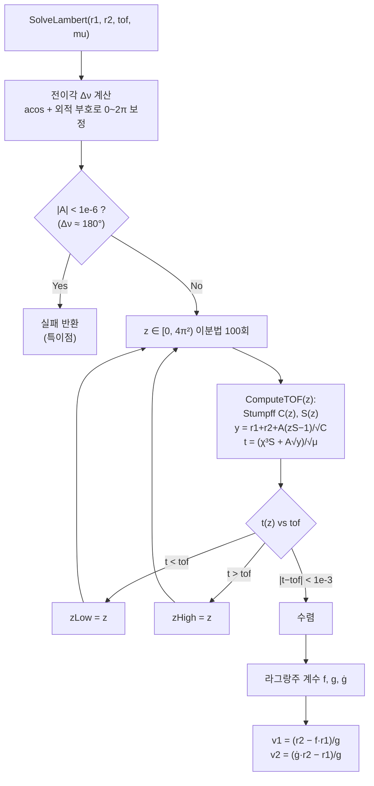

**Stumpff 함수** — 보편 변수 공식의 핵심. $z$의 부호가 궤도 종류를 결정한다.

$$
C(z) = \begin{cases}
\dfrac{1-\cos\sqrt{z}}{z} & z > 0 \;\text{(타원)} \\[8pt]
\dfrac{1-\cosh\sqrt{-z}}{z} & z < 0 \;\text{(쌍곡선)} \\[8pt]
\tfrac{1}{2} & z \approx 0 \;\text{(포물선)}
\end{cases}
\qquad
S(z) = \begin{cases}
\dfrac{\sqrt{z}-\sin\sqrt{z}}{(\sqrt{z})^3} & z > 0 \\[8pt]
\dfrac{\sinh\sqrt{-z}-\sqrt{-z}}{(\sqrt{-z})^3} & z < 0 \\[8pt]
\tfrac{1}{6} & z \approx 0
\end{cases}
$$

```cpp
static float StumpffC(float z)
{
    if      (z >  1e-6f) return (1.f - cosf (sqrtf( z))) / z;
    else if (z < -1e-6f) return (1.f - coshf(sqrtf(-z))) / z;
    else                 return 0.5f;                          // z→0 극한
}
```

$z \to 0$ 근처에서 분자·분모가 모두 0으로 가서 **0/0 형태의 수치 파탄**이 일어난다.
그래서 $|z| < 10^{-6}$ 구간은 테일러 전개의 극한값($1/2$, $1/6$)으로 직접 치환했다.
이 세 갈래 분기가 "궤도 종류를 몰라도 하나의 함수로 푼다"를 가능하게 하는 부분이다.

**본체**

```cpp
// 두 위치벡터 사이 전이각 (반시계 기준 0~2π)
float cosDNu = clamp(r1.Dot(r2) / (r1n * r2n), -1.f, 1.f);
float dNu = acosf(cosDNu);
if (r1.Cross(r2) < 0.f) dNu = 2π - dNu;

float A = sinf(dNu) * sqrtf(r1n * r2n / (1.f - cosDNu));
if (fabsf(A) < 1e-6f) return result;   // Δν≈180°: 궤도 평면이 정해지지 않는 특이점

auto ComputeTOF = [&](float z, float& outY) -> float
{
    float C = StumpffC(z), S = StumpffS(z);
    float y = r1n + r2n + A * (z * S - 1.f) / sqrtf(C);
    outY = y;
    if (y < 0.f) return -1.f;                       // 물리적으로 불가능한 z
    float chi = sqrtf(y / C);
    return (chi*chi*chi * S + A * sqrtf(y)) / sqrtf(mu);
};

float zLow = 0.f, zHigh = 4.f * π * π;              // 포물선 경계 ~ 한 바퀴 타원
for (int i = 0; i < 100; ++i)
{
    z = (zLow + zHigh) * 0.5f;
    float t = ComputeTOF(z, y);
    if (t < 0.f)  { zHigh = z; continue; }          // y<0 → 상한을 당김
    if (t < tof)    zLow  = z;
    else            zHigh = z;
    if (fabsf(t - tof) < 1e-3f) break;
}

// 라그랑주 계수로 속도 역산
float f    = 1.f - y / r1n;
float g    = A * sqrtf(y / mu);
float gDot = 1.f - y / r2n;
result.v1 = (r2 - r1 * f)    * (1.f / g);
result.v2 = (r2 * gDot - r1) * (1.f / g);
```

**설계 판단 3가지**

1. **뉴턴법이 아니라 이분법** — $t(z)$가 단조증가라 이분법이 항상 수렴한다. 뉴턴법은
   더 빠르지만 $\partial t/\partial z$ 계산이 복잡하고 발산 위험이 있다. 100회 이분이면
   구간이 $2^{-100}$로 줄어드는데, float 정밀도 한계에 훨씬 먼저 도달하므로 충분하다.
   **"수렴 보장"을 "수렴 속도"보다 우선**한 선택.
2. **$z$ 범위를 $[0, 4\pi^2)$로 제한** — 단일 회전(한 바퀴 이하) 해만 다룬다. 여러 바퀴
   도는 해나 쌍곡선 궤도($z<0$)는 이 게임의 전이에선 필요 없다. 주석에도 "빠른 응급전이를
   넣고 싶으면 `zLow = -4π²`로 수정"이라고 확장 지점을 남겨뒀다.
3. **$\Delta\nu \approx 180°$ 특이점은 실패 처리** — 이 경우 궤도 평면이 무수히 많아
   해가 유일하지 않다. 2단 스캔(§10.5)이 다른 TOF 후보를 계속 시도하므로, 하나가 실패해도
   전체는 정상 동작한다.

### 10.5 최적 TOF 탐색 — coarse → fine 2단 스캔

람베르트는 "TOF를 주면 속도를 준다"까지만 해준다. **최적 TOF는 직접 찾아야 한다.**

```
   Δv 총합
     ▲
     │╲                                    ╱
     │  ╲                                ╱
     │    ╲__                        __╱      ← 이 골짜기를 찾는다
     │       ╲__                  __╱
     │          ╲____▼_________╱
     └──┬──┬──┬──┬──┬──┬──┬──┬──┬──┬──┬──► TOF
        0.3·tH                        2.5·tH

   ① Coarse: 20개 균등 샘플 ────●─────────── 최소점 근방 발견
   ② Fine:   그 ±1.5스텝 구간을 80개로 정밀 재탐색  ▼
```

```cpp
TransferPlan FindBestTransfer(Vector2 shipPos, Vector2 shipVel, APlanet* target,
                              Vector2 sunPos, Vector2 sunVel, float sunMu)
{
    float r1     = (shipPos - sunPos).Length();
    float r2Now  = (target->GetCenterPos() - sunPos).Length();
    float hohmannTOF = ComputeHohmannTOF(r1, r2Now, sunMu);

    float tofMin = hohmannTOF * 0.3f;      // 호만보다 훨씬 빠른 고에너지 전이
    float tofMax = hohmannTOF * 2.5f;      // 호만보다 느긋한 전이

    TransferPlan coarse = ScanTOFRange(..., tofMin, tofMax, 20);
    if (not coarse.valid) return coarse;

    float coarseStep = (tofMax - tofMin) / 19.f;
    TransferPlan fine = ScanTOFRange(..., coarse.tof - coarseStep*1.5f,
                                          coarse.tof + coarseStep*1.5f, 80);
    return fine.valid ? fine : coarse;
}
```

**비용 비교** — 균등하게 같은 해상도를 얻으려면 $20 \times (80/3) \approx 533$개 샘플이
필요한데, 2단 스캔은 **100개**로 끝난다. 람베르트 한 번이 이분법 100회를 도는 걸 감안하면
5배 차이는 크다.

**각 후보의 평가**

```cpp
static TransferPlan ScanTOFRange(..., float tofMin, float tofMax, int sampleCount)
{
    Vector2 r1 = shipPos - sunPos;                       // 태양 기준 상대좌표 (§10.6)

    for (int i = 0; i < sampleCount; ++i)
    {
        float tof = tofMin + (tofMax - tofMin) * i / (float)(sampleCount - 1);

        Vector2 r2Abs = target->GetFuturePos(tof);       // ★ 그때 목표가 있을 자리
        Vector2 r2    = r2Abs - sunPos;

        LambertResult lam = SolveLambert(r1, r2, tof, sunMu);
        if (not lam.valid) continue;

        Vector2 v1Abs = lam.v1 + sunVel;                 // 상대속도 → 절대속도
        Vector2 v2Abs = lam.v2 + sunVel;
        Vector2 targetVelAtArrival = target->GetFutureVelocity(tof);

        float dv1 = (v1Abs - shipVel).Length();               // 출발 분사량
        float dv2 = (targetVelAtArrival - v2Abs).Length();    // 도착 감속량
        if (dv1 + dv2 < best.totalDeltaV) { /* 갱신 */ }
    }
}
```

`GetFuturePos(tof)` / `GetFutureVelocity(tof)` — §9.1의 폐형해가 여기서 결정적으로
쓰인다. 미래 위치를 **시뮬레이션 없이 즉시** 얻을 수 있으니, 100개 후보를 평가하는 데
행성 궤도를 100번 되감을 필요가 없다.

평가 기준이 `dv1 + dv2`(출발+도착 델타V 합)라는 것도 의미가 있다 — 단순히 "빨리 가는"
해가 아니라 **연료 효율이 가장 좋은** 해를 고른다. 실제 우주 미션 설계와 같은 기준.

### 10.6 태양이 움직이면서 깨진 전제 — 프레임 시프트

원래 람베르트 솔버는 **중력 초점이 원점 (0,0)에 있다**고 암묵적으로 가정한다.
태양이 `(0,0)`에 고정돼 있던 시절에는 아무 문제가 없었다.

그런데 태양이 은하 중심을 공전하기 시작하면서(§9.5) 이 전제가 깨졌다. 태양이
`(2,900,000, 500,000)` 같은 좌표에 있으면, 솔버는 "원점 주위를 도는 궤도"를 풀어버린다.

```
  ❌ 수정 전                                ✅ 수정 후
  원점 (0,0)이 초점이라고 가정               태양을 원점으로 옮겨 계산 후 되돌림

     🚀 ────────► ??                        r1 = shipPos − sunPos
    ╱                                       r2 = targetFuturePos − sunPos
  (0,0)      ☀ ← 진짜 초점은 여기            SolveLambert(r1, r2, tof, μ)
   가짜 초점                                 v1Abs = lam.v1 + sunVel  ← 되돌리기
```

```cpp
// 입력: 절대좌표 → 태양 상대좌표
Vector2 r1    = shipPos - sunPos;
Vector2 r2    = target->GetFuturePos(tof) - sunPos;
LambertResult lam = SolveLambert(r1, r2, tof, sunMu);

// 출력: 태양 상대속도 → 절대속도
Vector2 v1Abs = lam.v1 + sunVel;
Vector2 v2Abs = lam.v2 + sunVel;
```

이 보정은 §9.5의 `_orbitCenterBody` 체이닝과 **정확히 대칭**이다.

| | 문제 | 해법 |
|---|---|---|
| `_orbitCenterBody` | 부모가 움직이는데 자식이 모름 | 부모의 v, a를 **재귀로 더해줌** |
| 람베르트 프레임 시프트 | 초점이 움직이는데 솔버가 모름 | 초점 기준으로 **빼서 풀고 다시 더함** |

둘 다 "움직이는 기준계를 정지계로 바꿔 계산하고 결과를 되돌린다"는 갈릴레이 변환이다.

> 📌 이 수정은 한 번에 완결되지 않았다. `ScanTOFRange` 안에서 `r1`을 계산해놓고 정작
> `SolveLambert`에는 원래 `shipPos`를 넘기고 있었고(계산은 했으나 미사용),
> `FindBestTransfer`의 `r1`/`r2Now`도 `.Length()`를 그대로 쓰고 있었다. 파일을 다시 읽어
> 확인하는 과정에서 남은 세 곳을 찾아 고쳤다.
> (동일한 유형의 미완결이 §8.4 `targetPos`에 아직 남아 있다.)

### 10.7 전이 전체 시퀀스

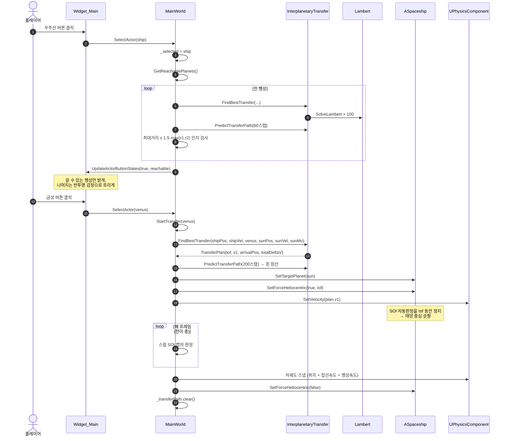

**`ForceHeliocentric`이 필요한 이유** — 전이 중에는 우주선이 출발 행성 SOI를 벗어나
태양 중력만 받아야 한다. 그런데 `UpdateTargetPlanet()`은 매 프레임 SOI를 다시 판정하므로,
출발 직후 아직 지구 SOI 안에 있으면 타겟을 지구로 되돌려버린다. `tof` 동안 자동 판정을
꺼서 계획대로 태양 중심 궤도를 타게 만든다.

```cpp
void ASpaceship::UpdateTargetPlanet()
{
    if (_forceHeliocentric) return;   // 강제 모드 중엔 SOI 자동 판정 스킵
    ...
}
```

같은 플래그가 `ComputeAcceleration`의 블랙홀 중력도 끈다 — 전이 궤도는 "태양 중력만"을
전제로 계산됐으므로, 계산 전제와 실제 물리를 일치시키기 위함이다.

### 10.8 도달 가능성 필터

모든 행성 버튼을 다 눌러볼 수 있게 하면, 위상이 심하게 어긋난 목적지는 **태양계를 크게
한 바퀴 도는 기괴한 궤도**가 나온다. 이걸 미리 걸러 버튼을 비활성화한다.

```cpp
constexpr float kMaxApoapsisRatio = 1.5f;

vector<Vector2> path = PredictTransferPath(shipPos, plan.v1, sunPos, sunMu, plan.tof, 60);
float maxDist = 0.f;
for (const Vector2& p : path) maxDist = max(maxDist, (p - sunPos).Length());

if (maxDist <= kMaxApoapsisRatio * max(r1, r2)) result.push_back(planet);
```

**기준의 근거** — 이상적인 호만전이의 원일점은 정확히 `max(r1, r2)`(비율 1.0)다.
1.5배까지 허용하면 위상이 조금 어긋난 정도는 봐주고, 크게 부푼 궤도만 걸러낸다.
"실패할 선택지를 애초에 못 누르게 한다"는 UX 판단이 물리 계산으로 구현된 사례.

### 10.9 예측 경로 렌더링

```cpp
vector<Vector2> PredictTransferPath(Vector2 pos, Vector2 vel, Vector2 sunPos,
                                    float sunMu, float tof, int steps)
{
    float dt = tof / steps;
    auto ComputeAccel = [&](Vector2 p) -> Vector2
    {
        Vector2 dir = sunPos - p;
        float r2 = dir.LengthSquared(), r = sqrtf(r2);
        return dir * (sunMu / (r2 * r));
    };
    for (int i = 0; i < steps; ++i) { /* RK4 한 스텝 */ path.push_back(pos); }
    return path;
}
```

`sunPos`를 **명시적 파라미터로** 받는다 — 처음부터 그렇게 설계돼 있어서, 태양이 움직이기
시작했을 때 이 함수만은 아무 수정이 필요 없었다. 반대로 원점을 암묵적으로 가정했던
`SolveLambert` 계열은 전부 손봐야 했다. **암묵적 전제 vs 명시적 파라미터**의 유지보수
비용 차이를 그대로 보여주는 대비.

용도별로 스텝 수가 다르다 — 화면 표시용 200스텝, 도달 가능성 판정용 60스텝
(9개 행성 × 매 클릭이라 비용에 민감).

---

## 11. SOI 시스템과 궤도 판정

### 11.1 영향권 반지름 (라플라스 근사)

$$r_{SOI} = a\left(\frac{\mu_{planet}}{\mu_{parent}}\right)^{2/5}$$

```cpp
float APlanet::GetSOIRadius(float parentMu) const
{
    if (parentMu <= 0.f or _mu >= parentMu) return 0.f;   // 자기가 부모보다 무거우면 무의미
    return _semiMajorAxis * powf(_mu / parentMu, 0.4f);
}
```

"이 안에서는 태양보다 이 행성의 중력이 지배적"이라고 볼 수 있는 경계다. 실제 우주역학의
표준 근사식을 그대로 썼다.

### 11.2 자동 중력원 전환 + 히스테리시스

```cpp
void ASpaceship::UpdateTargetPlanet()
{
    if (_forceHeliocentric) return;

    // ① 가장 무거운 천체 = 태양 (dominant)
    APlanet* dominant = nullptr;
    for (모든 행성) { if (planet->IsMoon()) continue; if (μ가 최대) dominant = planet; }
    if (not dominant) return;                    // 행성 없는 월드(LaunchWorld)는 균일중력 유지

    // ② 내가 지금 어느 SOI 안에 있는가 — 가장 "작은" SOI 우선 (더 가까운 천체)
    APlanet* best = nullptr; float bestSOI = FLT_MAX;
    for (모든 행성)
    {
        if (planet == dominant or planet->IsMoon()) continue;
        float soi = planet->GetSOIRadius(dominant->GetMu());
        if (soi <= 0.f) continue;

        float effectiveSOI = (planet == current) ? soi * 1.05f : soi;   // ★ 히스테리시스

        float distSq = (GetCenterPos() - planet->GetCenterPos()).LengthSquared();
        if (distSq <= effectiveSOI * effectiveSOI and soi < bestSOI) { best = planet; bestSOI = soi; }
    }
    SetTargetPlanet(best ? best : dominant);     // SOI 밖이면 태양으로 귀속
}
```

**히스테리시스가 없으면**

```
    SOI 경계
       │
   🚀 →│ 들어옴  → 타겟 = 지구 (중력 방향 급변)
   🚀 ←│ 나감    → 타겟 = 태양 (중력 방향 급변)
   🚀 →│ 들어옴  → ... 매 프레임 진동, 속도가 튀어오름
```

현재 타겟에만 **5% 여유**를 주면 진입 기준(100%)과 이탈 기준(105%)이 달라져 진동이
사라진다. 슈미트 트리거와 같은 원리.

**가장 작은 SOI 우선** — SOI가 겹치는 상황(예: 목성 SOI 안의 작은 위성)에서 더 가까운
천체를 고르기 위함이다. 큰 SOI는 대개 멀리 있는 거대 행성이다.

### 11.3 스윕 캡처 판정 — 터널링 방지

전이 중인 우주선이 목표 SOI에 도착했는지 매 프레임 검사하는데, 고배속에서는 한 프레임에
**SOI 지름보다 더 멀리** 이동할 수 있다.

```
   ❌ 점 샘플링 (터널링)              ✅ 스윕 판정 (선분 최근접점)

   프레임 N          프레임 N+1        프레임 N          프레임 N+1
      🚀                 🚀              🚀───────●────────🚀
       ╲    ⭕ SOI      ╱                 ╲     ╱  ╲      ╱
        ╲   (통과!)    ╱                   ╲  ⭕ SOI  ╱
         ╲___________╱                      ╲______╱
      두 샘플 다 SOI 밖 → 놓침          선분 위 최근접점이 SOI 안 → 감지
```

```cpp
// MainWorld::Update() — 물리 갱신 "전" 위치를 미리 저장
Vector2 shipPosBeforeUpdate = _ship->GetCenterPos();
Super::Update(deltaTime);

if (_transferTarget and not _transferCaptured)
{
    float soi = _transferTarget->GetSOIRadius(_sun->GetMu());
    Vector2 planetPos = _transferTarget->GetCenterPos();

    // 선분 위에서 행성에 가장 가까운 점 (사영을 [0,1]로 클램프)
    Vector2 seg = _ship->GetCenterPos() - shipPosBeforeUpdate;
    float segLenSq = seg.LengthSquared();
    float t = (segLenSq > 0.0001f)
            ? clamp((planetPos - shipPosBeforeUpdate).Dot(seg) / segLenSq, 0.f, 1.f) : 0.f;
    Vector2 closestOnPath = shipPosBeforeUpdate + seg * t;

    if ((closestOnPath - planetPos).LengthSquared() <= soi * soi) { /* 캡처 */ }
}
```

**수학** — 선분 $P_0 \to P_1$ 위에서 점 $C$에 가장 가까운 점은

$$t = \mathrm{clamp}\!\left(\frac{(C - P_0)\cdot(P_1-P_0)}{|P_1-P_0|^2},\, 0,\, 1\right), \qquad P_{closest} = P_0 + t\,(P_1 - P_0)$$

`clamp(0,1)`이 "선분 밖으로 나간 사영"을 양 끝점으로 되돌려, 무한 직선이 아니라 **이번
프레임에 실제로 지나온 구간**만 검사하게 만든다.

### 11.4 캡처 시 궤도 삽입

```cpp
Vector2 toShip = _ship->GetCenterPos() - planetPos;
float r = max(toShip.Length(), 1.f);
Vector2 dir  = toShip / r;
Vector2 perp(-dir.y, dir.x);                  // 반지름에 수직 (접선 방향)

// ★ 진입 방향(시계/반시계)을 상대속도의 외적 부호로 판정
Vector2 relVel = physics->GetVelocity() - _transferTarget->GetVelocity();
float cross = dir.x * relVel.y - dir.y * relVel.x;
if (cross < 0.f) perp = -perp;

float targetR = _transferTarget->GetBodyRadius() + 300.f;   // 고도 300 원궤도
float speed   = sqrtf(_transferTarget->GetMu() / targetR);  // 원궤도 속도 v = √(μ/r)

_ship->SetCenterPos(planetPos + dir * targetR);
physics->SetVelocity(perp * speed + _transferTarget->GetVelocity());   // ★ 행성 속도 합산
_ship->SetForceHeliocentric(false, 0.f);
_transferCaptured = true;
_transferPath.clear();                                       // 흰 점선 제거
```

세 가지 디테일:

- **외적 부호로 회전 방향 결정** — 그냥 `perp`를 쓰면 진입 방향과 반대로 도는 궤도가
  될 수 있다. 상대속도의 외적 부호가 "지금 어느 쪽으로 돌고 있는가"를 알려준다.
- **원궤도 속도** $v = \sqrt{\mu/r}$ — 원심력과 중력이 정확히 균형을 이루는 속도
  ($mv^2/r = \mu m/r^2$).
- **행성 속도를 더해준다** — 이걸 빼먹으면 우주선이 행성 기준으로는 원궤도지만 절대
  좌표계에서는 행성을 놓치고 뒤처진다. `LaunchWorld → MainWorld` 인계에서도 같은 실수가
  실제로 발생했다(§15.2).

### 11.5 궤도 판정 — 고전역학 공식의 직역

`OrbitalGameMode::Update()`가 매 프레임 궤도 상태를 계산한다.

```cpp
Vector2 r = _ship->GetCenterPos() - home->GetCenterPos();               // 상대 위치
Vector2 v = physics->GetVelocity() - home->GetVelocity();               // ★ 상대 속도
float mu = home->GetMu();

_eps = 0.5f * v.LengthSquared() - mu / r.Length();   // 비에너지 (specific orbital energy)
float h = r.Cross(v);                                 // 비각운동량 (2D는 스칼라)

_isEscaping = (_eps >= 0.f);                          // ε ≥ 0 → 포물선/쌍곡선 = 탈출

if (not _isEscaping)
{
    float a = -mu / (2.f * _eps);                                    // 장반경
    _eccentricity = sqrtf(max(0, 1 + (2.f*_eps*h*h) / (mu*mu)));     // 이심률
    _perigee = a * (1.f - _eccentricity);                            // 근지점
    _apogee  = a * (1.f + _eccentricity);                            // 원지점
}
```

| 공식 | 의미 |
|---|---|
| $\varepsilon = \frac{v^2}{2} - \frac{\mu}{r}$ | 단위질량당 총 역학적 에너지. **궤도 전체에서 보존** |
| $h = \mathbf{r} \times \mathbf{v}$ | 단위질량당 각운동량. 역시 보존량 |
| $a = -\mu / 2\varepsilon$ | 에너지 하나로 궤도 크기가 결정됨 |
| $e = \sqrt{1 + 2\varepsilon h^2/\mu^2}$ | 에너지+각운동량으로 궤도 모양 결정 |
| $r_{peri} = a(1-e),\; r_{apo} = a(1+e)$ | 승리 판정에 직접 사용 |

**`v`를 상대속도로 놓는 것이 핵심이다.** 지구가 태양을 돌든, 태양이 은하 중심을 돌든,
상대좌표계로 옮기면 부모 천체의 운동이 수식에서 완전히 소거된다. 덕분에 이 판정식은
**어떤 계층 깊이에서도 수정 없이 그대로 성립**한다.

**승리/실패 판정**

```cpp
_graceTimer += deltaTime;
bool crashedNow = r.Length() < home->GetBodyRadius();

if (_orbitState == EOrbitState::Flying && _graceTimer >= kGracePeriod)   // 10초 유예
{
    if      (crashedNow || _isEscaping)                     _orbitState = Failed;
    else if (_perigee > home->GetBodyRadius() + 200.f
             && _eccentricity < 0.5f)                       _orbitState = Cleared;
}
_isWarning = (!_isEscaping && _perigee < home->GetBodyRadius());   // 아직 안 부딪혔지만 예정된 추락
```

- **10초 유예(`kGracePeriod`)** — 전이 직후나 발사 직후의 과도 상태에서 즉시 실패
  판정되는 걸 막는다. 타겟이 바뀌면(`home != _home`) 타이머를 리셋한다.
- **`_isWarning`** — "지금은 안 부딪혔지만 근지점이 지면 아래" = 추락이 확정된 상태.
  실패로 처리하기 전에 경고를 띄울 수 있게 별도 플래그로 뺐다.
- **이심률 0.5 조건** — 너무 찌그러진 타원은 "안정 궤도"로 보지 않는다.

### 11.6 예측 궤도선 — 상대좌표 적분

```cpp
vector<Vector2> OrbitalGameMode::PredictPath(int steps, float dt) const
{
    // 행성 기준 상대좌표로 적분한다 (행성의 위치/속도/가속도가 전혀 필요 없음)
    Vector2 relPos = _ship->GetCenterPos()  - home->GetCenterPos();
    Vector2 relVel = physics->GetVelocity() - home->GetVelocity();

    Vector2 homePos = home->GetCenterPos();   // ★ "현재" 위치에 상대궤도 모양을 겹쳐 그린다
    for (int i = 0; i < steps; ++i)
    {
        float r = max(sqrtf(relPos.LengthSquared()), home->GetBodyRadius());
        Vector2 a = relPos * (-mu / (r*r*r));
        relVel += a * dt;
        relPos += relVel * dt;
        path.push_back(relPos + homePos);
    }
}
```

> **의도적으로 `GetFuturePos()`를 쓰지 않았다.**
> 지구가 100초 안에 수만 유닛을 이동하므로, 미래 위치를 반영하면 예측선이 화면 밖으로
> 쭉 뻗어나가 사라진다. 플레이어가 보고 싶은 건 "지구를 어떤 모양으로 도는가"이지
> "절대 좌표계에서의 실제 경로"가 아니다. §12.2에서 우주선 물리에는 정반대로
> `GetFuturePos()`가 **필요한** 것과 대비되는 판단 — 같은 함수를 쓸지 말지가
> "물리적 정확성"이 아니라 "이 값을 무엇에 쓰는가"로 갈린다.

---

## 12. 시간 배속(타임워프)

### 12.1 전파 경로

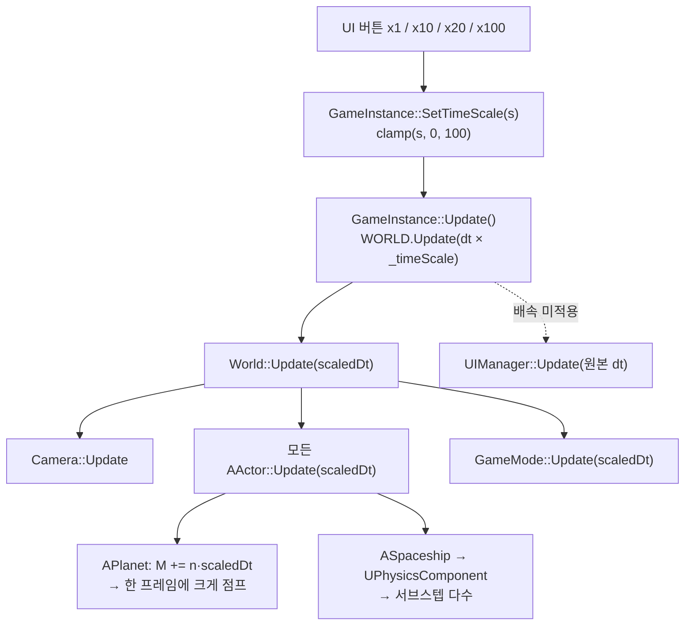

배속을 한 곳에서 곱해 전체에 흘려보내는 구조 자체는 단순하다. **문제는 델타타임이 원래
예상 범위(최대 0.1초)보다 100배 커지면서, "한 프레임 안의 값은 균일하다"고 암묵적으로
가정했던 모든 곳이 동시에 깨졌다는 것이다.** 이 프로젝트에서 가장 반복적으로 나타난
버그 유형.

### 12.2 버그 계열 3종

| # | 증상 | 근본 원인 | 해법 |
|---|---|---|---|
| 1 | x20/x100 버튼이 x10처럼 동작 | `SetTimeScale` clamp 상한이 10 | 상한 100으로 |
| 2 | 배속 시 우주선만 뒤처짐 | `MAX_STEPS=25` → 소화 가능 시간 0.104초 < 필요 10초 | 3000으로 |
| 3 | 배속 시 궤도가 서서히 어긋남 | **서브스텝이 참조하는 행성 위치가 프레임 끝 값** | `GetFuturePos(timeOffset)` |

**#2 계산**

```
MAX_STEPS = 25  → 25 × (1/240) = 0.104초 만 소화 가능
100배속 최악    → 0.1 × 100    = 10초    필요
필요 스텝 수    → 10 / (1/240) = 2400 스텝
→ MAX_STEPS = 3000 (여유 25%)
```

**#3 — 타임라인으로 보면 명확하다**

```
   한 프레임 (scaledDt = 2초, 480 서브스텝)

   t=0                                                  t=2초
    │                                                     │
    │  ① APlanet::Update() — 행성이 여기로 한 번에 점프 ──►●  (프레임 끝 위치)
    │                                                     │
    ├─②─┬───┬───┬───┬───┬─── 우주선 서브스텝 480회 ────────┤
      ▲   ▲   ▲   ▲   ▲
      └───┴───┴───┴───┴─ 전부 "프레임 끝 행성 위치"를 중력원으로 참조
                          → 아직 오지 않은 미래의 지구가 당기고 있음
```

액터 순회 순서상 행성이 우주선보다 먼저 갱신되면, 우주선의 480개 서브스텝이 **전부 2초
뒤의 지구 위치**를 본다. 배속이 클수록 이 시간 오차가 커져 궤도가 점점 어긋난다.

**해법 — 각 서브스텝에게 "너는 지금 몇 초 전이다"를 알려준다**

```cpp
void UPhysicsComponent::Update(float deltaTime)
{
    _accumulator += deltaTime;
    float timeOffset = -_accumulator;      // 첫 스텝은 프레임 끝 기준 -accumulator초 과거

    while (_accumulator >= FIXED_DT && steps < MAX_STEPS)
    {
        PhysicsStep(FIXED_DT, timeOffset);
        timeOffset += FIXED_DT;            // 스텝마다 전진
        _accumulator -= FIXED_DT;
    }
}

// ComputeAcceleration 내부 — 그 서브스텝 시점의 정확한 행성 위치
Vector2 targetPos = targetPlanet->GetFuturePos(targetTimeOffset);   // t<0 = 과거
```

`GetFuturePos(t)`가 **닫힌 형태**라는 점이 결정적이다. 시뮬레이션을 되감을 필요 없이
`M + n·t`를 대입하는 것만으로 임의 시점 위치가 나오므로, 서브스텝마다 호출해도
비용이 상수다.

```
   수정 후

   t=0                                                  t=2초
    ├─┬───┬───┬───┬───┬───┬───────────────────────────────┤
      │   │   │   │   │
      ▼   ▼   ▼   ▼   ▼     각 스텝이 GetFuturePos(자기 시점)로
     ●   ●   ●   ●   ●      그 순간의 정확한 지구 위치를 조회
   (지구가 매 스텝 조금씩 전진하는 것처럼 보임 = 물리적으로 올바름)
```

> ⚠️ **현재 코드 상태** — `timeOffset` 배관은 `Update` → `PhysicsStep` → 4개
> `ComputeAcceleration` 호출까지 전부 연결돼 있으나, `ComputeAcceleration` 본문에서
> `targetPos`를 계산만 하고 `dir`은 여전히 `GetCenterPos()`로 만들고 있다
> (§8.4 참고). 즉 이 수정은 **현재 무효 상태**이며, 한 줄 변경으로 활성화된다.

### 12.3 궤도 세차(precession)는 버그가 아니다

배속을 올리면 우주선 궤도의 방향이 계속 회전하는 것처럼 보인다. 이건 §8.4의

```cpp
a += targetPlanet->GetAcceleration();   // 지구가 태양을 도는 가속도
```

보정 항이 만드는 **진짜 물리 현상**이다. 지구의 공전 주기는 약 314초인데, 100배속에서는
실시간 3.14초마다 지구가 한 바퀴를 돈다. 지구 기준 궤도가 태양 방향 섭동을 받아 세차하는
것이 그만큼 압축돼 보일 뿐이다.

"고배속에서는 이 항을 감쇠시켜 궤도를 고정으로 보이게 할 것인가(게임적 편의) vs 그대로
둘 것인가(물리적 정직성)"를 명시적으로 판단해, **그대로 두기로 결정**했다.
게임의 목적 자체가 "궤도역학을 체감시키는 것"이므로 현상을 숨기는 게 오히려 손해라는
판단.

### 12.4 배속 UI

```cpp
static const float    kSpeedOptions[4] = { 1.f, 10.f, 20.f, 100.f };
static const wchar_t* kSpeedLabels [4] = { L"x1", L"x10", L"x20", L"x100" };

Vector2 smallBtnSize = Vector2(btnSize.x * .5f, btnSize.y);   // 가로만 절반 → 4개 나란히
for (int i = 0; i < 4; ++i)
{
    constexpr float kSpeedButtonY = 190.f + kMaxActorButtons * 32.f + 20.f;   // 액터 버튼 아래
    _speedButtons[i]->Init(EAnchor::Top, EPivot::Top,
                           Vector2(-90.f + i * 60.f, kSpeedButtonY), smallBtnSize);
    float speed = kSpeedOptions[i];
    _speedButtons[i]->SetOnClick([speed]() { GAME.SetTimeScale(speed); });
}
```

Y 좌표를 `kMaxActorButtons`에서 **계산**해서, 액터 버튼 개수가 바뀌어도 배속 버튼이
겹치지 않는다. 람다는 `speed`를 **값 캡처**한다 — 참조로 캡처하면 루프 변수가 죽은 뒤
댕글링이 된다.

---

# Part III. 표현과 흐름

## 13. 절차적 렌더링

텍스처 하나 없이, GDI 픽셀 버퍼 직접 조작과 수식만으로 만든 효과들.

### 13.1 SpaceLightingSystem — 이중 버퍼 구조

```
_pBgPixels (배경 백업, new BYTE[w*h*4])      _pPixels (DIB 실제 렌더 버퍼)
        │                                              │
 BeginRender()                                          │
   ├ memset 0 (검정)                                    │
   ├ 별 60만 개 투영 (AABB 컷 후 밝기 180)               │
   └ memcpy ────────────────────────────────────────────┤
                                                        │
                                        RenderSunGlow / ApplyPlanetShadow
                                        ApplyBlackHoleLensing  ← _pBgPixels에서 샘플링
                                                        │
                                        EndRender() → BitBlt → 게임 버퍼
```

**왜 배경 백업 버퍼가 따로 필요한가** — 중력 렌즈는 "다른 좌표의 배경 픽셀을 끌어와
현재 좌표에 쓴다". 만약 같은 버퍼에서 읽고 쓰면, 이미 왜곡된 픽셀을 또 왜곡하는
되먹임이 생겨 얼룩이 번진다. 원본 배경을 별도로 보관해야 모든 픽셀이 **동일한 원본**을
참조한다.

### 13.2 Glow — 프리멀티플라이 알파 캐싱 텍스처

발광 효과를 매 프레임 계산하지 않고, 초기화 때 한 번 만들어 캐싱한다.

```cpp
bool Glow::Create(int size, COLORREF color)
{
    // CreateDIBSection으로 32비트 BGRA 버퍼 확보
    for (int y = 0; y < size; ++y)
    for (int x = 0; x < size; ++x)
    {
        float distNorm = sqrt(dx*dx + dy*dy) / center;      // 0(중심) ~ 1(가장자리)

        // 역제곱 법칙 기반 방사형 감쇠
        float factor = 1.f / (1.f + _k * (distNorm * distNorm));   // _k = 8
        factor = max(0.f, factor - 0.2f) / 0.8f;                    // 외곽 테두리 정리

        BYTE a = (BYTE)(clamp(factor, 0.f, 1.f) * 255.f);

        // ★ Premultiplied Alpha: RGB에 알파를 미리 곱해둔다
        pPixels[idx]     = (BYTE)((b * a) / 255);   // B
        pPixels[idx + 1] = (BYTE)((g * a) / 255);   // G
        pPixels[idx + 2] = (BYTE)((r * a) / 255);   // R
        pPixels[idx + 3] = a;                       // A
    }
}
```

```
   밝기 프로파일 (k=8)

   1.0 ┤●
       │ ╲                factor = 1/(1 + 8·d²)
   0.5 ┤   ╲___
       │        ╲___      → (factor − 0.2)/0.8 로 재정규화
   0.0 ┤            ╲●___ → 가장자리에서 정확히 0 (테두리 안 생김)
       └────┬────┬────┬──► distNorm
            0.33 0.66  1.0
```

두 가지 포인트:

- **`- 0.2` 후 `/ 0.8` 재정규화** — 역제곱 감쇠는 무한대까지 꼬리가 남아 가장자리에
  희미한 사각 테두리가 보인다. 0.2 이하를 잘라내고 다시 0~1로 펴면 경계가 깨끗하게
  사라진다.
- **프리멀티플라이 알파** — `AlphaBlend`의 `AC_SRC_ALPHA`는 RGB에 알파가 이미 곱해진
  포맷을 요구한다. 안 지키면 밝은 부분에 검은 테두리(halo)가 생긴다.

```cpp
bool Glow::Render(HDC hdcDest, const Vector2& centerPos, float radius, BYTE intensity)
{
    BLENDFUNCTION bf = { AC_SRC_OVER, 0, intensity, AC_SRC_ALPHA };
    return AlphaBlend(hdcDest, destX, destY, destSize, destSize,
                      _hdc, 0, 0, _size, _size, bf) != FALSE;
}
```

캐싱된 텍스처를 `AlphaBlend`로 스케일링해 찍기만 하므로, 크기가 달라도 재계산이 없다.
용도별로 색/크기가 다른 6개를 미리 만들어둔다 — 태양(256, 주황), 엔진(128, 주황),
강착원반(256, 백색), 블랙홀(256, 백색), 구름(200, 백색), 연기(220, 회색).

### 13.3 별 배경 — AABB 사전 컷

60만 개 별을 매 프레임 행렬 변환하면 프레임이 무너진다. **화면 네 모서리를 월드로
역변환**해 보일 수 있는 영역을 먼저 구하고, 비교 4번으로 걸러낸다.

```cpp
Vector2 c0 = cam.ScreenToWorld({0, 0});
Vector2 c1 = cam.ScreenToWorld({(float)_width, 0});
Vector2 c2 = cam.ScreenToWorld({0, (float)_height});
Vector2 c3 = cam.ScreenToWorld({(float)_width, (float)_height});
float minX = min(min(c0.x,c1.x), min(c2.x,c3.x));   // ... 네 모서리로 AABB
...
for (const Vector2& star : _starsWorld)
{
    if (star.x < minX || star.x > maxX || star.y < minY || star.y > maxY) continue;  // ★ 4번 비교
    Vector2 s = cam.WorldToScreen(star);             // 통과한 것만 행렬 변환
    ...
}
```

네 모서리를 다 변환하는 이유는 **카메라가 회전할 수 있기 때문**이다. 회전하면 화면
사각형이 월드에서 기울어진 사각형이 되므로, 좌상단·우하단 두 점만으로는 영역이 부족하다.

> 📌 초기에는 20만 개를 범위 ±300만에 뿌렸는데, 화면에 실제 들어오는 건 전체의 0.04%뿐이라
> 20만 번 순회해서 100개 남짓만 그리는 구조였다. 범위를 실제 스케일(가장 먼 행성 기준)에
> 맞추자 **더 가벼우면서 동시에 더 잘 보이게** 됐다. 같은 실수를 `LaunchWorld` 별
> (태양계 범위를 복붙)과 블랙홀 주변 별(반경을 사건지평선보다 작게 잡음)에서도 반복했다.

**별의 차등 회전** — 별 전체가 태양 중심으로 아주 느리게 돌되, 멀수록 느리게 돈다.

```cpp
constexpr float kMaxRotSpeed = 0.01f, kOrbitFalloffDist = 50000.f;
float angularSpeed = kMaxRotSpeed * expf(-dist / kOrbitFalloffDist);
// 회전 행렬을 직접 적용 (2×2)
star = { star.x*c - star.y*s, star.x*s + star.y*c };
```

### 13.4 블랙홀 — 3단 렌더 순서

```cpp
void SpaceLightingSystem::ApplyBlackHoleLensing(const Vector2& bhPos, float bhRadius, float distortionStr)
{
    float effectRadius = bhRadius * 3.5f;

    // ① 배경 왜곡 (사건지평선 바깥 ~ effectRadius)
    for (스캔 영역 픽셀)
    {
        float dist = (currentPos - bhPos).Length();
        if (dist < bhRadius || dist >= effectRadius) continue;

        float factor = pow(bhRadius / dist, 1.5f) * distortionStr;
        float edgeFade = 1.f - clamp((dist - effectRadius*0.7f) / (effectRadius*0.3f), 0.f, 1.f);
        factor *= edgeFade;                              // 바깥 30%에서 부드럽게 0으로

        Vector2 srcPos = currentPos + (diff * (factor / dist));   // 바깥쪽에서 끌어옴
        _pPixels[targetIdx] = _pBgPixels[srcIdx];                 // ★ 배경 백업에서 샘플링
    }

    // ② 강착원반 글로우
    _accretionGlow->Render(_hDIBDC, bhPos, effectRadius * 0.8f, 220);

    // ③ 빨려드는 별들
    for (const FallingStar& fs : _fallingStars) { /* 흰 픽셀 */ }

    // ④ 이벤트 호라이즌 — 맨 마지막에 검은 코어를 다시 뚫는다
    for (스캔 영역 픽셀) if (dist < bhRadius) { RGB = 0; }
}
```

```
   ①  왜곡된 별      ②  + 글로우        ③  + 공전하는 별   ④  + 검은 코어
   ∴∵∴∵∴∵∴∵         ∴∵░░░░░∵∴          ∴∵░░·░░∵∴         ∴∵░░·░░∵∴
   ∵∴  ╲│╱  ∴∵      ∵∴░▒▒▒▒▒░∴         ∵∴░▒▒▒▒▒░∴        ∵∴░▒▒▒▒▒░∴
   ∴∵ ──●── ∵∴  →   ∴∵░▒███▒░∵∴   →    ∴∵░▒███▒░∵∴  →    ∴∵░▒●●●▒░∵∴
   ∵∴  ╱│╲  ∴∵      ∵∴░▒▒▒▒▒░∴         ∵∴·▒▒▒▒▒░∴        ∵∴·▒▒▒▒▒░∴
```

> 📌 **"그리는 순서" 버그가 세 번 반복됐다.**
> ① 글로우를 먼저 그렸더니 왜곡 루프가 그 자리를 다른 곳의 배경으로 덮어써서 사라짐 →
> 순서를 뒤집으니 이번엔 글로우가 검은 코어를 덮어씀 → 코어를 맨 마지막에 다시 뚫는
> 3단 구조로 확정. ③ 이후 "빨려드는 별"을 추가했을 때 **같은 원인으로 세 번째 재발**
> (왜곡 루프보다 먼저 그려서 지워짐). 앞선 두 번의 경험 덕분에 원인을 즉시 짚어
> 같은 3단 구조 안에 편입시켰다.

**왜곡 수식** — 지수 1.5는 물리적으로 정확한 값(실제 아인슈타인 편향각은 $\propto 1/r$)이
아니라, 시각적으로 가장 그럴듯한 값으로 튜닝한 것이다. 중요한 건 **가까울수록 급격히
강해지고, 경계에서 부드럽게 0으로 수렴**한다는 성질이다.

**빨려드는 별의 분포**

```cpp
float t = (float)rand() / RAND_MAX;
s.radius = eventRadius + powf(t, 4.f) * (maxRadius - eventRadius);   // ★ t⁴
```

균등 분포(`t`)면 별이 넓게 흩어져 강착원반처럼 안 보인다. `t⁴`로 편향시키면 **대부분이
사건지평선 근처에 몰려** 실제 강착원반의 밀도 분포를 흉내낸다.

**공전 속도 — 각운동량 보존 흉내**

```cpp
float swirlSpeed = kBaseSwirlSpeed * (_blackHoleClusterRadius / fs.radius);   // 가까울수록 빠름
fs.angle  += swirlSpeed * deltaTime;
fs.radius -= kFallSpeed * deltaTime;
if (fs.radius < _blackHoleEventRadius) fs.radius = _blackHoleClusterRadius;   // 재활용
```

$\omega \propto 1/r$ — 안쪽으로 빨려들수록 각속도가 빨라진다. 사건지평선에 닿으면 바깥에서
재생성해 파티클 개수를 일정하게 유지한다(할당 없는 순환).

### 13.5 행성 그림자 — 부채꼴 스캔

```
        ☀ 태양
         ╲
          ╲  dir (주축 단위벡터)
           ╲
            ● 행성 (반지름 R)
           ╱│╲
          ╱ │ ╲       halfWidth = R + shadowDist × 0.15
         ╱  │  ╲          ↑ 거리에 비례해 부채꼴이 벌어짐
        ╱   │   ╲
       ╱  그림자  ╲     distFade: 멀수록 옅어짐 (kFadeRange=800)
      ╱     │     ╲    edgeFade: 가장자리 15px 부드럽게
     ╱──────┴──────╲
```

```cpp
for (스캔 영역 픽셀)
{
    Vector2 sunToPixel = Vector2(x, y) - sunPos;
    float proj = sunToPixel.Dot(dir);                   // 주축 방향 사영
    if (proj <= distSunPlanet) continue;                // 행성보다 앞쪽(태양 쪽)은 제외

    float shadowDist = proj - distSunPlanet;
    float halfWidth  = planetRadius + shadowDist * kSpreadRate;

    // 피타고라스로 수직거리 (|v|² = proj² + perp²) — sqrt 한 번만
    float perpDist = sqrt(max(0.f, sunToPixel.LengthSquared() - proj * proj));
    if (perpDist >= halfWidth) continue;

    float distFade = 1.f - clamp(shadowDist / kFadeRange, 0.f, 1.f);
    float edgeFade = 1.f - clamp((perpDist - (halfWidth - kEdgeSoftness)) / kEdgeSoftness, 0.f, 1.f);
    float darken   = 1.f - kMaxDarken * distFade * edgeFade;

    _pPixels[idx] = (BYTE)(_pPixels[idx] * darken);     // 곱셈 = 어둡게 (색조 유지)
}
```

**최적화 3가지**

- 스캔 영역을 `farPoint = planetPos + dir·kFadeRange`와 `maxHalfWidth`로 계산한
  바운딩 박스로 제한한다. 화면 대각선 전체를 스캔하던 초기 버전보다 훨씬 좁다.
- 수직거리를 `sqrt(|v|² - proj²)` 피타고라스로 구해 벡터 뺄셈+제곱근을 줄였다.
- 색상을 대입이 아니라 **곱셈**으로 어둡게 한다 — 원본 색조를 유지하면서 밝기만 낮춘다.

### 13.6 대기권 — 레일리 산란에서 유도한 하늘색

하늘색을 팔레트에서 고르지 않고 **물리 공식에서 유도**했다.

$$\beta \propto \frac{1}{\lambda^4} \quad\Longrightarrow\quad
\beta_R : \beta_G : \beta_B = \left(\tfrac{470}{650}\right)^4 : \left(\tfrac{470}{530}\right)^4 : 1 \approx 0.27 : 0.61 : 1.0$$

```cpp
COLORREF LaunchWorld::ComputeRayleighSkyColor(float density)
{
    static const float betaR[3] = { 0.27f, 0.61f, 1.0f };   // R≈650nm, G≈530nm, B≈470nm
    float k = 255.f;                                        // 노출값
    BYTE r = (BYTE)clamp(k * density * betaR[0], 0.f, 255.f);
    BYTE g = (BYTE)clamp(k * density * betaR[1], 0.f, 255.f);
    BYTE b = (BYTE)clamp(k * density * betaR[2], 0.f, 255.f);
    return RGB(r, g, b);
}
```

짧은 파장(파랑)이 4제곱만큼 더 강하게 산란되므로 하늘이 파랗다. `density`가 고도에 따라
줄면 세 채널이 함께 어두워지며 자연스럽게 우주의 검정으로 수렴한다 — **보간 없이 공식만으로
지상→우주 전이가 나온다.**

**대기권 띠(림) 연출** — 고도가 오르면 화면 위에서부터 우주(검정)→파랑→흰빛→주황→지상색
5색 그라디언트가 아래로 밀려 내려온다.

```cpp
float t        = clamp((altitude - 1500) / (2000 - 1500), 0, 1);   // 띠가 자리잡는 구간
float blackout = clamp((altitude - 2000) / (2450 - 2000), 0, 1);   // 다시 검정으로 압축

float blackEnd  = 0.6f * t;
float blueEnd   = blackEnd  + 0.1f  * t;
float brightEnd = blueEnd   + 0.05f * t;
float orangeEnd = brightEnd + 0.1f  * t;

blackEnd  += (1.f - blackEnd)  * blackout;   // blackout=1이면 전부 1로 수렴 = 화면 전체 검정
// ... 나머지도 동일

::GradientFill(hdc, vert, 8, gRect, 4, GRADIENT_FILL_RECT_V);   // 4구간 세로 그라디언트
```

`t`가 0이면 모든 경계가 0이 되어 화면 전체가 지상색, `blackout`이 1이면 모든 경계가 1로
수렴해 화면 전체가 우주색. **두 파라미터의 곱/보간만으로 전 구간이 연속적으로 이어진다.**

### 13.7 파티클 시스템

```cpp
struct EngineParticle { Vector2 pos, velocity; float radius, maxLife, currentLife;
                        BYTE intensity; EParticleType type; };

void SpaceLightingSystem::UpdateAndRenderParticle(float deltaTime)
{
    for (auto it = _particles.begin(); it != _particles.end();)
    {
        it->currentLife -= deltaTime;
        if (it->currentLife <= 0.0f) { it = _particles.erase(it); continue; }

        it->pos += it->velocity * deltaTime;

        float lifeRatio     = it->currentLife / it->maxLife;
        float currentRadius = it->radius * (2.f - lifeRatio);          // 점점 커짐
        BYTE  currentAlpha  = (BYTE)(255.f * (lifeRatio * lifeRatio)); // ★ 제곱 감쇠

        Glow* glow = (it->type == EParticleType::Smoke) ? _smokeGlow : _engineGlow;
        glow->Render(_hDIBDC, it->pos, currentRadius, currentAlpha);
        ++it;
    }
}
```

**제곱 감쇠(`lifeRatio²`)** — 선형이면 파티클이 "뚝 끊기듯" 사라진다. 제곱하면 초반은
밝게 유지되다 후반에 급격히 사라져 훨씬 자연스럽다.

**화염 vs 연기** — 같은 구조체를 `EParticleType`으로 구분해 파라미터만 바꾼다.

| | 화염(Engine) | 연기(Smoke) |
|---|---|---|
| 퍼짐 | ±0.25 | ±0.6 (2.4배) |
| 속도 | 100~150 | 30~70 |
| 반지름 | 10~20 | 16~30 |
| 수명 | 0.4~0.73초 | 1~2초 |
| 글로우 | 주황 | 회색 |

발사대 연기(`_launchSmoke`)는 `LaunchWorld`가 별도로 관리하는데, 속도 감쇠에
프레임 독립 지수감쇠를 쓴다.

```cpp
it->velocity *= powf(0.3f, deltaTime);   // 초당 30%로 감속 (dt 무관)
```

`v *= 0.3f`처럼 하면 프레임레이트에 따라 감속 속도가 달라진다. `pow(ratio, dt)`는
"초당 30%"라는 의미를 프레임레이트와 무관하게 보장한다 — §7.6의 `exp(-k·dt)`와 같은 원리.

---

## 14. UI 프레임워크

### 14.1 앵커 / 부모앵커 / 피벗

Unity의 RectTransform과 유사한 3요소 배치 시스템.

```
   Anchor: 화면(또는 패널)의 어느 지점을 기준으로 삼는가
   ┌─────────────────────┐
   │ LT     T        RT  │      최종 위치 계산:
   │                     │
   │ L    Center      R  │        _x = _anchorX + 입력 x
   │                     │        _y = _anchorY + 입력 y
   │ LB     B        RB  │        _finalX = _x − (_width  × _pivotRatioX)
   └─────────────────────┘        _finalY = _y − (_height × _pivotRatioY)

   Pivot: 자기 자신의 어느 점을 그 위치에 맞출 것인가
      LT(0,0)   T(0.5,0)   RT(1,0)
      L (0,0.5) C(0.5,0.5) R (1,0.5)
      LB(0,1)   B(0.5,1)   RB(1,1)
```

`EParentAnchor`는 화면이 아니라 **부모 UI 요소**를 기준으로 삼는다. 버튼 안의 텍스트를
중앙 정렬할 때 쓴다.

```cpp
_actorButtons[i]->SetText(EParentAnchor::Center, EPivot::Center,
                          Vector2(0, 5), btnSize, text, 14.f);
```

부모 중앙에 앵커 → 자기 중앙을 피벗 → 결과적으로 완벽한 중앙 정렬. `Vector2(0, 5)`는
폰트 베이스라인 보정용 미세 오프셋.

### 14.2 이중 좌표계 — 정적 플래그로 전환

게임 뷰포트(600px 기준)와 사이드 패널(300px 기준)은 앵커 기준 폭이 다르다. 이걸 매번
파라미터로 넘기지 않고, **생성 구간을 감싸는 정적 플래그**로 처리한다.

```cpp
void Widget_Main::Init()
{
    UIBase::SetActiveUISpace(true);      // 여기부터 패널 좌표계
    _titleText = AddChild<UIText>();
    _titleText->Init(EAnchor::Top, ...);
    // ... 수십 개 UI 생성 ...
    UIBase::SetActiveUISpace(false);     // 원상 복구 (다음에 만들 UI가 영향받지 않게)
}
```

```cpp
void UIBase::SetAnchor(EAnchor anchor)
{
    _anchor = anchor;
    _usePanelSpace = s_activeSpaceIsPanel;   // ★ 이 시점의 플래그를 인스턴스에 "캡처"

    float refW = _usePanelSpace ? (float)GImGuiPanelWidth : (float)GWinSizeX;
    float refH = (float)GWinSizeY;
    // ... refW/refH로 _anchorX/_anchorY 계산
}
```

**정적 플래그를 인스턴스가 캡처하는 게 핵심이다.** `Update()`는 한참 뒤에도 계속 불리는데,
그때 전역 플래그를 다시 읽으면 엉뚱한 좌표계가 적용된다. 생성 시점의 소속을
`_usePanelSpace`에 박아두면 이후로는 항상 자기 좌표계로 동작한다.

### 14.3 마우스 히트 판정 — 두 좌표계의 서로 다른 보정

```cpp
bool UIBase::IsHoverInUI(Vector2 mousePos)
{
    Vector2 scaledMouse;
    if (_usePanelSpace)
    {
        RECT panelRect = GAME.GetPanelViewportRect();
        Vector2 local = mousePos - Vector2(panelRect.left, panelRect.top);  // ① 패널 원점으로
        Vector2 ratio = GAME.GetPanelRectRatio();                            // ② x/y 각각 다름
        scaledMouse = Vector2(local.x / ratio.x, local.y / ratio.y);
    }
    else
    {
        scaledMouse = mousePos / GAME.GetRectRatio();                        // 게임은 단일 비율
    }
    return (범위 검사);
}
```

§4.2에서 게임은 비율 유지(`float`), 패널은 각축 독립(`Vector2`)으로 스케일한다고 했는데,
그 차이가 여기서 그대로 나타난다. 패널은 **오프셋도 빼야** 한다(화면 좌상단이 아니라
게임 뷰포트 오른쪽에서 시작하므로).

### 14.4 UIButton — 호버/비활성 상태

```cpp
void UIButton::Update(float deltaTime)
{
    if (!_isInteractable)                     // 비활성: 호버 반응 없이 원래 크기 고정
    { SetSize(_originSize.x, _originSize.y); ... return; }

    if (IsHoverInUI(_INPUT.GetMousePos()))
    {
        SetSize(_originSize.x * _hoverRate, _originSize.y * _hoverRate);   // 확대
        _text->SetFontSize(_originFontSize * _hoverRate);                  // 글자도 같이
        _text->InitButton(...);                                            // 커진 기준으로 재배치
        if (_INPUT.GetButtonDown(KeyType::LeftMouse)) { if (_onClick) _onClick(); }
    }
    else { /* 원래 크기 복구 */ }
}
```

`_originSize`를 따로 보관하는 이유 — 매 프레임 `_width`에 배율을 곱하면 호버가 유지되는
동안 **누적되어 무한히 커진다**. 항상 원본에서 다시 계산해야 한다.

**비활성 표현 — 반투명 검정 오버레이**

```cpp
static HDC dimHdc = nullptr;                     // 1×1 검은 비트맵 (최초 1회만 생성)
if (!dimHdc) { dimHdc = CreateCompatibleDC(hdc); ... SetPixel(dimHdc, 0, 0, RGB(0,0,0)); }

BLENDFUNCTION bf = { AC_SRC_OVER, 0, 150, 0 };   // ★ AlphaFormat = 0
AlphaBlend(hdc, _finalX, _finalY, _width, _height, dimHdc, 0, 0, 1, 1, bf);
```

`Glow`(§13.2)와 정반대 설정이다 — 여기선 `AlphaFormat = 0`으로 두고 `SourceConstantAlpha`만
쓴다. 원본 픽셀의 알파를 무시하고 **1×1 불투명 검정을 균일한 비율로** 얹는 방식.
1×1 비트맵을 버튼 크기로 늘려 쓰므로 메모리도 거의 안 든다.

### 14.5 액터 버튼 시스템

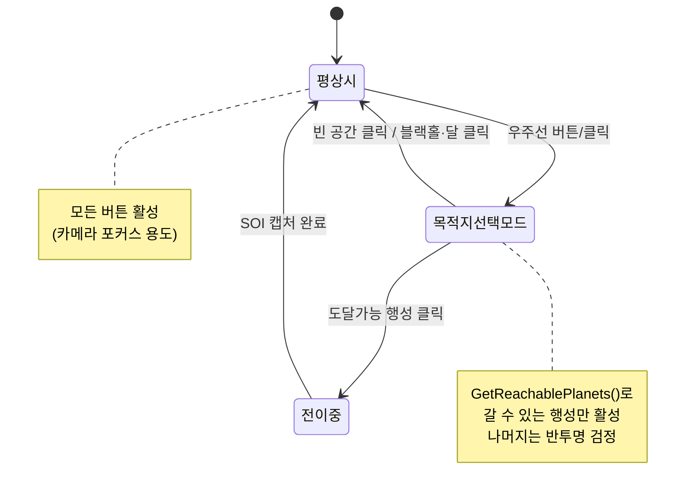

```cpp
void MainWorld::SelectActor(AActor* actor)
{
    if (actor == _ship)                       // ① 우주선 → 목적지 선택 모드 진입
    {
        _selected = _ship;
        _camera.SetFollowTarget(_ship);
        _widget->UpdateActorButtonStates(true, GetReachablePlanets());
        SOUND.Play(L"S_Spaceship", true);
        return;
    }
    else SOUND.Stop(L"S_Spaceship");

    if (_selected == _ship)                   // ② 선택 모드에서 행성 클릭 → 전이
    {
        if (APlanet* planet = dynamic_cast<APlanet*>(actor))
            if (not planet->IsMoon()) { StartTransfer(planet); return; }
    }

    _selected = actor;                        // ③ 그 외 → 포커스만
    _camera.SetFollowTarget(actor);
    _widget->UpdateActorButtonStates(false, {});
}
```

**뷰포트 클릭과 버튼 클릭이 같은 함수로 수렴한다.** `PickActor`로 잡은 액터도,
`_onActorSelected` 콜백으로 온 액터도 전부 `SelectActor()`를 탄다 — 입력 경로가 둘이어도
동작 정의는 한 곳에만 존재한다.

**위성 버튼 배치** — 부모 행성 버튼의 **행 인덱스를 역으로 찾아** 그 오른쪽에 붙인다.

```cpp
int parentIndex = -1;
for (int i = 0; i < _actorButtonCount; ++i)
    if (_actorButtonTargets[i] == parent) { parentIndex = i; break; }
if (parentIndex < 0) continue;               // 부모 버튼이 없으면 스킵

_moonButtons[slot]->Init(EAnchor::LeftTop, EPivot::LeftTop,
    Vector2(20.f + btnSize.x + 8.f, 190.f + parentIndex * 32.f), smallSize);
```

부모 위치를 하드코딩하지 않아서, 행성 목록이 바뀌어도 위성이 자동으로 따라간다.

---

## 15. 전체 코드 흐름 시나리오

### 15.1 부팅

```
WinMain
 ├ 윈도우 생성 (CreateWindowW)
 ├ ImGui_ImplWin32_Init / ImGui_ImplGDI_Init          (Debug만)
 └ GameInstance::Init(hwnd)
    ├ srand(time(0))
    ├ GetDC → RecreateBackBuffer (CreateDIBSection, 픽셀 포인터 확보)
    ├ _hdcGame (600×800), _hdcPanel (300×800) 생성
    ├ TimeManager::Init (QueryPerformanceFrequency)
    ├ InputManager::Init
    ├ SoundManager::Init(hwnd)  ← ResourceManager보다 먼저! (사운드 로드 시 디바이스 필요)
    ├ ResourceManager::Init(hwnd, "../Resources/")
    ├ DataManager::Init + Load  (ResourceData.json 파싱)
    ├ 사운드 전량 프리로드
    ├ RegisterWorld × 5         (팩토리 람다 등록)
    ├ WORLD.ChangeWorld("TitleWorld")  ← 첫 부팅은 즉시 적용 (Enter까지 완료)
    └ UIManager::Init           ← 첫 World가 텍스처를 로드한 "다음"이어야 함
```

**초기화 순서에 세 개의 의존성이 박혀 있다.** SoundManager → ResourceManager(사운드 로드),
World::Enter → UIManager(텍스처 참조), ResourceData 파싱 → World::loadResources.
`ChangeWorld`가 첫 부팅만 예외적으로 즉시 적용되는 것도 이 순서 때문이다.

### 15.2 LaunchWorld → MainWorld 인계

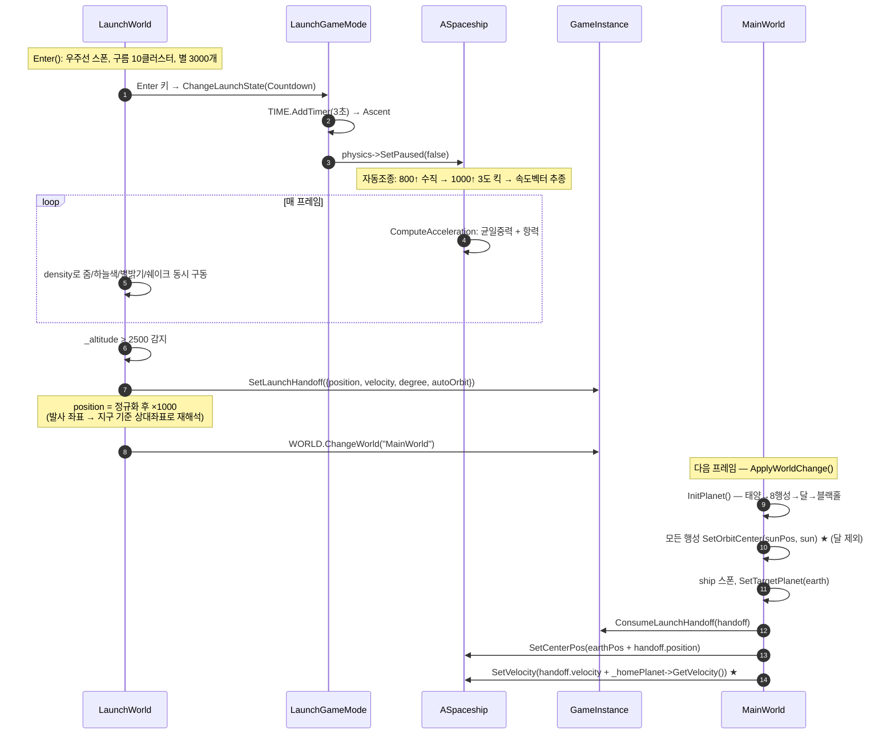

> 📌 **인계에서 실제로 터진 버그** — `_homePlanet->GetVelocity()`를 더하는 코드는 원래
> 있었는데, `InitPlanet()` 끝의 `SetOrbitCenter(sunPos, sun)` 일괄 연결 루프가 **없던 시절**
> 에는 지구의 `_orbitCenterBody`가 아직 nullptr여서 태양의 은하 공전 속도(≈90 units/s)가
> 누락됐다. 지구 저궤도 속도가 ≈124 units/s이므로 **72%의 상대 오차** — 궤도가 깨지고도
> 남는 크기다. `InitPlanet()` 끝에서 부모 연결을 완료시켜 해결했다.
> "값을 더하는 코드는 맞는데 그 값이 아직 완성되지 않은 시점에 읽었다"는 **초기화 순서
> 버그**의 전형.

### 15.3 MainWorld 프레임 상세

```
MainWorld::Update(scaledDt)
 ├ ① for (planet) planet->RefreshOrbitCenter()      ← 부모 좌표 동기화 (§9.5)
 ├ ② Vector2 shipPosBeforeUpdate = ship->GetCenterPos()   ← 스윕 판정용 (§11.3)
 ├ ③ World::Update(scaledDt)
 │    ├ Camera::Update (쉐이크/팔로우/줌/드래그 → 뷰행렬)
 │    ├ APlanet::Update × 10  (M += n·dt → 폐형해 위치)
 │    ├ ASpaceship::Update
 │    │   ├ ForceHeliocentric 타이머 감소
 │    │   ├ UpdateTargetPlanet()  (SOI 스캔 + 히스테리시스)
 │    │   ├ Input / AutoPilot
 │    │   ├ 연료 소모 + 클램프
 │    │   ├ 궤적 샘플링 (0.05초 간격, 최대 1500점)
 │    │   ├ 고도/수평속도 변화 이벤트 발송 (콜백)
 │    │   └ UPhysicsComponent::Update → 서브스텝 루프 → RK4
 │    ├ UpdateCollider 전수
 │    ├ CheckOverlaps / ProcessPendingDestroy
 │    └ OrbitalGameMode::Update  (이벤트호라이즌 → 비에너지 → 근/원지점 → 판정)
 ├ ④ 스윕 SOI 캡처 판정 (전이 중일 때만)
 ├ ⑤ 은하 드리프트 누적: _camera.AddGalacticDrift(300 × dt)
 ├ ⑥ V키 사이드뷰 토글 / 궤적 기록 (0.1초 간격, 최대 6000점)
 ├ ⑦ 마우스 클릭 → PickActor → SelectActor / DeselectActor
 ├ ⑧ 디버그 텔레포트 (KEY_0: 지구 저궤도, KEY_1: 블랙홀 근처)
 └ ⑨ 위젯 갱신 (연료 비율, 헤딩)

MainWorld::Render(hdc)
 ├ ① lighting->BeginRender(camera)     별 60만 AABB 컷 → _pBgPixels → _pPixels 복사
 ├ ② RenderSunGlow(태양 위치, 반지름×15)
 ├ ③ for (행성) ApplyPlanetShadow(태양, 행성, 반지름)
 ├ ④ ApplyBlackHoleLensing(블랙홀, clamp(반지름, 15, 80), 100)
 ├ ⑤ lighting->EndRender(hdc)          → BitBlt로 게임 버퍼에 합성
 ├ ⑥ 엔진 파티클 스폰 + 갱신/렌더
 ├ ⑦ 행성 궤도 점선 (GetOrbitShapeTimed(150) → 시간차만큼 Z 보정)
 ├ ⑧ (사이드뷰) 행성 궤적 — 행성별 고유색
 ├ ⑨ (톱뷰) 전이 예측 경로 흰 점
 ├ ⑩ World::Render — 액터 스프라이트 (행성 텍스처, 우주선 회전 렌더)
 └ ⑪ (톱뷰) 궤도 예측선 시안색 점 (PredictPath(200, 0.5))
```

---

## 16. 성능 예산과 최적화

### 16.1 프레임 예산 (120 FPS = 8.33ms)

| 항목 | 비중 | 비고 |
|---|---|---|
| 별 배경 (60만 개 AABB 컷) | 큼 | 컷이 없으면 단독으로 프레임을 무너뜨림 |
| 블랙홀 렌즈 픽셀 루프 | 큼 | `effectRadius = bhRadius×3.5`, 화면 반지름 15~80으로 clamp |
| 행성 그림자 (9개) | 중 | 바운딩 박스로 제한 |
| 물리 서브스텝 | 배속 비례 | 1배속 2스텝 → 100배속 최대 2400스텝 |
| 궤도 점선 (9행성 × 150점) | 중 | `GetOrbitShapeTimed`는 케플러 6회 반복 포함 |
| 레터박스 StretchBlt | 중 | 창 크기 == 논리 크기면 BitBlt로 우회 |

### 16.2 적용한 최적화

| 기법 | 위치 | 효과 |
|---|---|---|
| **AABB 사전 컷** | 별 배경 | 행렬 변환 전에 비교 4번으로 걸러냄 |
| **화면 반지름 clamp** | 블랙홀 렌즈 | 줌인 시 픽셀 루프가 화면 전체로 폭발하는 것 방지 |
| **바운딩 박스 스캔** | 행성 그림자 | 화면 대각선 전체 → 그림자 영역만 |
| **Glow 텍스처 캐싱** | 모든 발광 | 매 프레임 감쇠식 계산 → `AlphaBlend` 1회 |
| **회전 버퍼 캐싱** | `Texture::RenderRotated` | 호출마다 DC/비트맵 생성/파괴 제거 |
| **1×1 딤 비트맵 재사용** | `UIButton` | `static`으로 최초 1회만 생성 |
| **케플러 반복 생략** | `GetOrbitShape` | 모양만 필요하면 E를 직접 훑어 뉴턴법 6회 제거 |
| **2단 TOF 스캔** | 전이 계획 | 533샘플 → 100샘플 (5배) |
| **`_collider` 직접 캐싱** | `AActor` | 핫패스에서 `dynamic_cast` 탐색 제거 |
| **`COLORONCOLOR`** | StretchBlt | `HALFTONE` 대비 수십 ms 절약 |
| **1D 인덱스 순회** | 그리드 등록 | 이중 루프 → 단일 루프 |
| **파티클 순환 재사용** | 블랙홀 별 | 사건지평선 도달 시 재배치, 할당 없음 |

### 16.3 되돌린 최적화 — 행성 회전 렌더링

행성 텍스처가 미리 라이팅되어 있어 공전해도 하이라이트가 화면상 고정 방향을 향하는
문제를 고치려 `RenderRotated`를 행성 9개에 적용했더니 **fps가 10까지 떨어졌다.**
원인은 회전 렌더링이 호출마다 임시 DC/비트맵을 생성·파괴하는 구조였기 때문. 캐싱으로
최적화했지만 이번엔 캐시 크기 계산 버그(§6.2)가 새로 생겼다.

최종적으로 **성능 대비 이득이 크지 않다고 판단해 회전 렌더링 자체를 롤백**하고, 이미
있던 실시간 그림자(`ApplyPlanetShadow`)로 낮/밤 표현을 대신했다. 캐싱 코드는
우주선(1개만 회전)에 그대로 남아 활용되고 있다.

> "구현해서 붙이는 것"과 "붙일 가치가 있는지 성능으로 검증하는 것"은 별개다.
> 되돌린 결정도 근거(fps 수치)와 함께 남기면 회고 자료가 된다.

---

## 17. 설계 결정 요약

| # | 결정 | 대안 | 선택 이유 |
|---|---|---|---|
| 1 | 엔진/물리 라이브러리 미사용 | Unity, Box2D | 증명 대상이 물리 그 자체 |
| 2 | 행성 = 폐형해 케플러 | 수치적분 | 오차 무누적 + **시간 역행 가능**(전이/배속의 전제) |
| 3 | Patched-conic (단일 중심체) | N-body | 시뮬레이션 붕괴 방지. "시간이 남아도 안 넣는다"고 명시 |
| 4 | RK4 기본 + 심플렉틱 병기 | 하나만 | 정확도 확보 + 적분기 특성 비교 증명 |
| 5 | 고정 타임스텝 누적기 | 가변 dt | 프레임레이트 독립 물리 |
| 6 | `_orbitCenterBody` 재귀 체이닝 | 위치 하드코딩 | 임의 깊이 계층을 코드 한 벌로 (달 기능이 거의 공짜) |
| 7 | 람베르트 + 2단 TOF 스캔 | 고정 호만전이 | 임의 위상에서도 유효한 해 |
| 8 | 이분법 (뉴턴법 아님) | 뉴턴-랩슨 | 수렴 보장 > 수렴 속도 |
| 9 | SOI 5% 히스테리시스 | 단순 비교 | 경계 진동 제거 |
| 10 | 스윕(선분) 캡처 판정 | 점 샘플링 | 고배속 터널링 방지 |
| 11 | `IsMoon()` 명시적 플래그 | 암묵적 처리 | 미지원 범위를 타입으로 표현 → 확장 시 작업 범위 확정 |
| 12 | 씬 전환/액터 삭제 지연 적용 | 즉시 delete | use-after-free 구조적 차단 |
| 13 | 고정 논리 해상도 + 레터박스 | 가변 해상도 | 리사이즈 대응을 렌더 마지막 한 곳으로 격리 |
| 14 | 패널을 게임과 분리 | 통합 | Debug(ImGui)/Release 레이아웃 일치 |
| 15 | JSON 주도 리소스 | 하드코딩 | 텍스처 추가에 코드 수정 불필요 |
| 16 | 궤도 세차 그대로 유지 | 고배속 감쇠 | 물리 체감이 게임의 목적 |
| 17 | 회전 렌더링 롤백 | 캐싱 유지 | fps 10 → 이득 대비 비용 과다 |
| 18 | 표면 정렬 회전 폐기 | 완성 | 실제 게임 흐름에서 필요 없음이 판명 |

---

## 18. 부록

### 18.1 소스 파일 맵

```
FirstOrbit/
├─ FirstOrbit.cpp            WinMain, 메시지 루프, 120fps 소프트웨어 페이싱
├─ pch.h                     전역 상수(GWinSizeX/Y, GMaxDeltaTime, GAtmosphereScaleHeight)
├─ Structs.h                 Vector2, Matrix3x3, AABB, HitResult  ← 직접 구현한 선형대수
│
├─ Core/                     매니저 계층 (전부 Singleton)
│  ├─ GameInstance           창/3단 버퍼/레터박스/timeScale/LaunchHandoff
│  ├─ WorldManager           씬 등록·전환 (지연 적용)
│  ├─ TimeManager            QPC 델타타임 + 클램프 + 콜백 타이머
│  ├─ InputManager           4상태 키 머신, 마우스
│  ├─ ResourceManager        Texture/Sound 캐시
│  ├─ DataManager/ResourceData  JSON 파싱
│  ├─ SoundManager/Sound     DirectSound + WAV 직접 파싱
│  ├─ UIManager              Widget 컨테이너
│  └─ Util                   각도 변환, LerpAngle, SolveKeplerEquation
│
├─ GameFramework/            엔진 계층
│  ├─ AActor                 Transform + 컴포넌트 소유
│  ├─ World                  액터 컨테이너 + 그리드 브로드페이즈 + 피킹
│  ├─ Camera                 3×3 뷰행렬, 줌/회전/쉐이크/사이드뷰
│  ├─ GameMode               게임 규칙 베이스
│  ├─ Texture                BMP 로드, TransparentBlt, PlgBlt 회전(캐싱)
│  ├─ ObjectPool             타입별 풀 + IObjectPool 인터페이스
│  ├─ UIBase                 앵커/피벗/이중 좌표계
│  ├─ Components/
│  │  ├─ UPhysicsComponent   ★ 고정 타임스텝, 적분기 3종, 가속도 모델
│  │  ├─ UColliderComponent  AABB/Circle 판정 + MTV + Overlap 이벤트
│  │  └─ USprite/UAnimator
│  └─ UI/                    Widget, UIButton, UIText, UISlider, UIHeadingIndicator, UIImage
│
├─ Actor/
│  ├─ APlanet                ★ 케플러 궤도, _orbitCenterBody 체이닝, SOI, 궤적
│  ├─ ASpaceship             SOI 자동타겟팅, 자동조종, 연료, 궤적
│  ├─ ABlackHole             중력원 (SOI 시스템과 별개 타입)
│  └─ StarField              LaunchWorld 별 배경
│
├─ GameMode/
│  ├─ LaunchGameMode         발사 상태머신 (Idle→Countdown→Ascent→Failed/Success)
│  └─ OrbitalGameMode        ★ 비에너지/이심률/근·원지점 판정, 예측선
│
├─ GameSystem/
│  ├─ Lambert                ★ Universal Variable 솔버 + Stumpff 함수
│  ├─ InterplanetaryTransfer ★ 위상각, 호만 TOF, 2단 스캔, 경로 예측
│  ├─ SpaceLightingSystem    별/글로우/그림자/중력렌즈/파티클
│  └─ Glow                   프리멀티플라이 알파 발광 텍스처
│
├─ Worlds/                   Title, Launch, Main, GameOver, Editor
└─ Widget/                   Widget_Title, Widget_Launch, Widget_Main
```

### 18.2 핵심 공식 색인

| 공식 | 코드 위치 |
|---|---|
| $\text{View} = T(h)S(z)R(\theta)T(-p)$ | `Camera::UpdateViewMatrix` |
| $M^{-1} = [A^{-1} \mid -A^{-1}t]$ (아핀) | `Matrix3x3::Inverse` |
| $\mathbf{a} = \mu\,\mathbf{dir}/r^3$ | `UPhysicsComponent::ComputeAcceleration` |
| $\mathbf{a}_{drag} = -k\rho\|v\|\mathbf{v}$, $\rho = e^{-h/H}$ | 동상 |
| $M = E - e\sin E$ (뉴턴법 6회) | `Util::SolveKeplerEquation` |
| $\nu = 2\arctan_2(\sqrt{1{+}e}\sin\tfrac{E}{2}, \sqrt{1{-}e}\cos\tfrac{E}{2})$ | `APlanet::ComputePositionAtEccentricAnomaly` |
| $r = a(1 - e\cos E)$ | 동상 |
| $\dot{\mathbf{r}} = \frac{na^2}{r}(-\sin E, \sqrt{1{-}e^2}\cos E)$ | `APlanet::ComputeVelocityAtEccentricAnomaly` |
| $\mu_{eff} = n^2a^3$ (케플러 3법칙) | `APlanet::GetAcceleration` |
| $r_{SOI} = a(\mu_p/\mu_s)^{0.4}$ | `APlanet::GetSOIRadius` |
| $\varepsilon = v^2/2 - \mu/r$ | `OrbitalGameMode::Update` |
| $h = \mathbf{r}\times\mathbf{v}$ | 동상 |
| $a = -\mu/2\varepsilon$, $e = \sqrt{1 + 2\varepsilon h^2/\mu^2}$ | 동상 |
| $t_H = \pi\sqrt{a_t^3/\mu}$ | `ComputeHohmannTOF` |
| $\theta_{ideal} = \pi - n\,t_H$ | `ComputePhaseAngleError` |
| Stumpff $C(z)$, $S(z)$ | `Lambert.cpp` |
| $y = r_1 + r_2 + A(zS-1)/\sqrt{C}$ | `SolveLambert::ComputeTOF` |
| $f = 1 - y/r_1$, $g = A\sqrt{y/\mu}$ | `SolveLambert` |
| $v = \sqrt{\mu/r}$ (원궤도) | `MainWorld` 캡처/텔레포트 |
| $\beta \propto 1/\lambda^4$ | `LaunchWorld::ComputeRayleighSkyColor` |
| $1/(1 + kd^2)$ (발광 감쇠) | `Glow::Create` |
| $(R/d)^{1.5}$ (렌즈 왜곡) | `ApplyBlackHoleLensing` |

### 18.3 조작 키

| 키 | 동작 |
|---|---|
| `Enter` | (LaunchWorld) 자동 발사 시작 |
| `W`/`↑` | 추력 |
| `A`/`D`, `←`/`→` | 회전 |
| `R` | (LaunchWorld) 리셋 |
| `V` | (MainWorld) 사이드뷰 토글 |
| `P` | 씬 전환 (디버그) |
| `0` / `1` | 지구 저궤도 / 블랙홀 근처로 텔레포트 (디버그) |
| `F1` | 디버그 모드 (콜라이더 시각화) |
| `F4` | ImGui 데모 창 |
| 좌클릭 | 액터 피킹 / UI |
| 우클릭 드래그 | 카메라 이동 |
| 휠 | 줌 (마우스 위치 앵커링) |

### 18.4 알려진 미완결 사항

정직하게 기록해두는 항목들. (전부 실제 코드 확인 기준)

| # | 내용 | 영향 | 상태 |
|---|---|---|---|
| 1 | `ComputeAcceleration`의 `targetPos` 미사용 (`dir`이 `GetCenterPos()` 사용) | §12.2 배속 보정이 **무효** | 한 줄 수정으로 해결 가능 |
| 2 | `OnSceneGUI()`의 전이 거리 표시가 원점 기준 `.Length()` | 디버그 텍스트만 부정확 | 의도적으로 미수정 (GUI 미사용) |
| 3 | 그리드 브로드페이즈가 화면 크기 기준 | 태양계 스케일에서 무의미 | 게임플레이 영향 없음 (피킹은 별도 경로) |
| 4 | `GridCols = 600/80 = 7` (나눠떨어지지 않음) | 효율 소폭 손해 | clamp로 동작은 정상 |
| 5 | Overlap 이벤트 델리게이트 사용처 없음 | 없음 | 인프라만 존재 |
| 6 | `_thrust` 주석의 TWR 1.75 (실제 1.25) | 문서만 | 주석 갱신 필요 |
| 7 | 위성 계층 SOI 미지원 | 달로 전이 불가 | `IsMoon()`으로 명시적 제외 |
| 8 | 착륙 시스템 없음 | 궤도 진입이 종료 지점 | 로드맵에서 의도적 제외 |

### 18.5 관련 문서

| 문서 | 내용 |
|---|---|
| `README.md` | 프로젝트 소개, 빌드 방법 |
| `기획서_우주발사.md` | 최초 기획 의도 |
| `주차별_로드맵.md` | 3주 계획 + 스코프 방어 원칙 (✂️ 잘라낸 것들) |
| `설계_클래스다이어그램.md` | 초기 설계 단계 다이어그램 |
| `docs/study/기술_회고_포트폴리오.md` | 회고 — 판단·디버깅 방법론 |
| `docs/study/1~4주차_troubleShooting.md` | 시간순 버그 기록 (증상/원인/해결) |
| `docs/study/궤도전이_학습노트.md` | 호만전이·람베르트 학습 노트 |
| `docs/study/조명_가이드.md` | `SpaceLightingSystem`/`Glow` 구현 노트 |
| `docs/study/UI패널_리팩터링_01~06.md` | UI 시스템 리팩터링 과정 |


