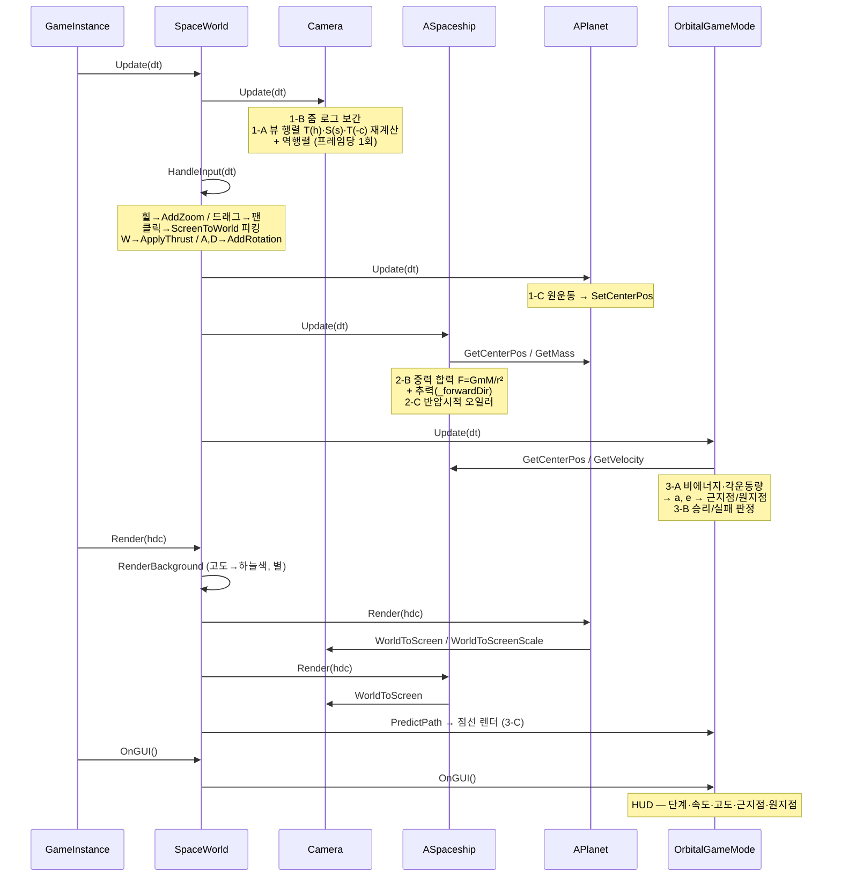
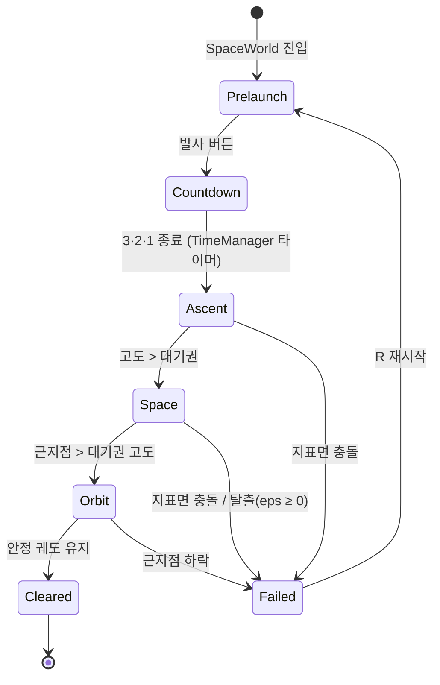

# 설계 — 클래스 다이어그램 & 소유 관계

> 기존 엔진(회색)과 이번에 추가할 우주 게임 콘텐츠(★)의 관계도.
> 코드 레벨 TODO는 `구현_설계_미리보기.md` 참고.

---

## 1. 전체 계층 (한눈에)

```
[ 앱 생애주기 ]
GameInstance (Singleton)
  │  창/백버퍼/레터박스, 매니저 초기화, 메시지 루프 진입점
  └─ WorldManager (Singleton)  ─ 씬 등록/전환
       └─ World  (현재 활성 씬 1개)
            ├─ Camera            ← ✏️ World가 소유 (지금은 고아 클래스)
            ├─ vector<AActor*>   ← 액터 컨테이너 (소유)
            └─ GameMode          ← 게임 규칙 (소유, CreateGameMode()로 생성)

[ 지원 매니저 (전부 Singleton) ]
TimeManager  InputManager  ResourceManager  SoundManager  DataManager  UIManager
```

---

## 2. 클래스 다이어그램 (Mermaid)

```mermaid
classDiagram
    direction TB

    %% ================= 엔진 (기존) =================
    class World {
        <<engine>>
        #vector~AActor*~ _actors
        #GameMode* _gameMode
        #Camera _camera 〔추가〕
        +Enter()
        +Update(dt)
        +Render(hdc)
        +OnGUI()
        +SpawnActor~T~() T*
        +GetActor(idx) AActor*
        +GetActorCount() int32
        +GetCamera() Camera& 〔추가〕
        #CreateGameMode()* GameMode*
        #OnSceneGUI()*
        #GetResourceSectionName()* wstring
    }

    class AActor {
        <<engine>>
        #World* _ownerWorld
        #vector~UActorComponent*~ _components
        #Vector2 _pos 〔좌상단〕
        #Vector2 _center 〔중심〕
        #float _degree
        #Vector2 _forwardDir
        +Init()*
        +Update(dt)*
        +Render(hdc)*
        +SetCenterPos(v)
        +GetCenterPos() Vector2
        +SetRotation(deg)
        +AddComponent~T~() T*
    }

    class GameMode {
        <<engine>>
        #World* _world
        #EGameState _state
        +Init(World*)*
        +Update(dt)*
        +OnGUI()*
        +SetGameOver()
    }

    class Camera {
        <<engine·수정>>
        -Vector2 _position
        -float _zoom, _targetZoom
        -float _rotation, _targetRotation 〔추가〕
        -float _manualRotation 〔Q/E 디버그〕
        -Matrix3x3 _view 〔추가〕
        -Matrix3x3 _invView 〔추가〕
        -int _width, _height
        +Init(w, h)
        +Update(dt) 〔추가〕
        +WorldToScreen(v) Vector2
        +ScreenToWorld(v) Vector2 〔추가〕
        +WorldToScreenScale(len) float 〔추가〕
        +SetZoom(z) 〔추가〕
        +AddZoom(d) 〔추가〕
        +SetRotation(rad) 〔1-F〕
        +AddManualRotation(d) 〔추가〕
        +SetMode(mode) 〔1-D〕
        +SetFollowTarget(actor) 〔추가〕
        -UpdateViewMatrix() 〔1-A〕
        -BlendParams(dt) 〔0-E〕
        -ECameraMode _mode
        -Vector2 _blendFromPos
        -float _blendFromRot, _blendFromZoom
        -float _blend
    }

    class Matrix3x3 {
        <<★신규 struct>>
        +float m[3][3]
        +Identity()$ Matrix3x3
        +Translate(t)$ Matrix3x3
        +Scale(s)$ Matrix3x3
        +Rotate(rad)$ Matrix3x3
        +operator*(o) Matrix3x3 〔0-B〕
        +TransformPoint(p) Vector2 〔0-C〕
        +TransformVector(v) Vector2
        +Inverse() Matrix3x3 〔0-D〕
        +InverseGeneral() Matrix3x3 〔0-D' 검산〕
        +Lerp(a,b,t)$ Matrix3x3 〔0-E' 실패관찰〕
    }

    class Vector2 {
        <<engine·수정>>
        +float x, y
        +Length() float
        +LengthSquared() float
        +Dot(v) float
        +Cross(v) float
        +Rotate(rad) Vector2
        +Normalize() 〔in-place〕
        +Normalized() Vector2 〔추가〕
    }

    %% ================= 우주 게임 (신규 ★) =================
    class SpaceWorld {
        <<★신규>>
        -APlanet* _home
        -ASpaceship* _ship
        -float _skyBlend
        +Enter()
        +Update(dt)
        +Render(hdc)
        #CreateGameMode() GameMode*
        #OnSceneGUI()
        -HandleInput(dt)
        -RenderBackground(hdc)
    }

    class APlanet {
        <<★신규>>
        -Vector2 _orbitCenter
        -float _orbitRadius
        -float _orbitSpeed
        -float _angle
        -float _mass
        -float _bodyRadius
        +Init()
        +Update(dt) 〔1-C 원운동〕
        +Render(hdc) 〔GDI 원〕
        +Setup(...)
        +GetMass() float
        +GetBodyRadius() float
    }

    class ASpaceship {
        <<★신규>>
        -Vector2 _velocity
        -float _mass
        -float _thrustPower
        -bool _thrusting
        -EIntegrator _integrator
        -float _fuel, _fuelMax, _fuelBurn
        +Init()
        +Update(dt) 〔2-C/2-D 적분 + 2-E 연료〕
        +Render(hdc) 〔GDI 도형〕
        +ApplyThrust(bool)
        +GetVelocity() Vector2
        +GetFuelRatio() float
        +SetIntegrator(EIntegrator)
        -AccelerationAt(pos) Vector2 〔2-B〕
    }

    class EIntegrator {
        <<enumeration>>
        ExplicitEuler
        SemiImplicitEuler
        RK4
    }

    class ECameraMode {
        <<enumeration>>
        Fixed
        Follow
    }

    class OrbitalGameMode {
        <<★신규>>
        -ASpaceship* _ship
        -APlanet* _home
        -float _perigee
        -float _apogee
        -float _altitude
        -EFlightPhase _phase
        +Init(World*)
        +Update(dt) 〔3-A 궤도요소 + 3-B 판정〕
        +OnGUI() 〔HUD〕
        +PredictPath(steps, dt) vector~Vector2~ 〔3-C〕
    }

    class OrbitState {
        <<★신규 struct>>
        +Vector2 pos
        +Vector2 vel
    }

    %% ================= 관계 =================
    World <|-- SpaceWorld
    AActor <|-- APlanet
    AActor <|-- ASpaceship
    GameMode <|-- OrbitalGameMode

    World *-- "1" Camera : 소유
    World *-- "0..*" AActor : 소유
    World *-- "1" GameMode : 소유

    SpaceWorld ..> APlanet : SpawnActor
    SpaceWorld ..> ASpaceship : SpawnActor
    SpaceWorld ..> OrbitalGameMode : CreateGameMode

    OrbitalGameMode --> ASpaceship : 참조(소유X)
    OrbitalGameMode --> APlanet : 참조(소유X)
    OrbitalGameMode ..> OrbitState : 예측 적분용 복사

    ASpaceship ..> APlanet : 중력원 순회
    APlanet ..> Camera : 렌더 시 좌표 변환
    ASpaceship ..> Camera : 렌더 시 좌표 변환

    Camera *-- "2" Matrix3x3 : _view / _invView
    Camera --> ECameraMode : 모드
    Camera --> AActor : _target (참조, 소유X)
    Matrix3x3 ..> Vector2 : TransformPoint
    ASpaceship --> EIntegrator : 런타임 토글
```



> 💡 Mermaid가 안 보이면 VS Code의 Markdown Preview 또는 GitHub에서 열 것.

---

## 3. 소유 관계 (메모리 책임)

누가 `delete`하는지가 헷갈리면 이 표만 보면 된다.

| 객체 | 생성 | 소멸 | 비고 |
|---|---|---|---|
| `SpaceWorld` | `WorldManager`가 팩토리 람다로 `new` | `WorldManager` | `RegisterWorld("SpaceWorld", ...)` |
| `Camera` | `World`의 **값 멤버** | 자동 | 포인터 아님 → 누수 없음 |
| `APlanet` / `ASpaceship` | `World::SpawnActor<T>()` | `World::~World()`가 전부 `delete` | `_actors`에 등록됨 |
| `OrbitalGameMode` | `SpaceWorld::CreateGameMode()` | `World::~World()`가 `delete` | |
| `_ship` / `_home` (GameMode 안) | — | **delete 금지** | 단순 참조 포인터 |
| `OrbitState` | 스택 | 자동 | 액터 복사 금지의 대안 |

> ⚠️ `OrbitalGameMode`의 `_ship`/`_home`은 **관찰용 포인터**다.
> 소유자는 `World`이므로 GameMode에서 절대 `delete`하지 않는다.

---

## 4. 한 프레임 시퀀스



---

## 5. 상태 머신 (비행 단계)

`OrbitalGameMode`가 관리한다. HUD의 "단계" 표시와 카메라 줌 목표를 함께 구동한다.



| 단계 | 카메라 줌 목표 | 하늘 | 중력의 역할 |
|---|---|---|---|
| Prelaunch / Countdown | 최대 (지표면 클로즈업) | 파랑 | 끌어내리는 적 |
| Ascent | 고도에 비례해 축소 | 파랑 → 검정 | 여전히 적 |
| Space | 행성이 원으로 보이는 배율 | 검정 + 별 | 반전 직전 |
| Orbit / Cleared | 궤도 전체가 들어오는 배율 | 검정 | 공전시키는 도구 |

> 📌 **하나의 값(고도)이 하늘색·별 밝기·줌 목표를 동시에 구동한다.**
> 이 "단일 값으로 여러 연출을 몰기"가 기획서 7.1 연출의 구현 핵심이다.

---

## 6. 파일 배치 (최종)

```
FirstOrbit/
├─ Core/                       (기존 매니저 — InputManager만 ✏️ 휠 추가)
├─ GameFramework/
│  ├─ Camera.h/.cpp            ✏️ 줌 + 역변환
│  ├─ World.h/.cpp             ✏️ Camera 소유
│  ├─ OrbitalGameMode.h/.cpp   ★ 신규
│  └─ (AActor, GameMode, Texture, ... 기존)
├─ Actors/                     ★ 신규 폴더
│  ├─ APlanet.h/.cpp           ★
│  └─ ASpaceship.h/.cpp        ★
├─ Worlds/
│  ├─ SpaceWorld.h/.cpp        ★ 신규
│  └─ (Title, Main, GameOver, Editor 기존)
├─ pch.h                       ✏️ Vector2::Normalized + const화, ★ Matrix3x3 추가
└─ FirstOrbit.vcxproj          ✏️ 신규 파일 등록
```

---

## 7. 설계 판단 요약 (회고 문서용 재료)

| 결정 | 대안 | 왜 이걸 골랐나 |
|---|---|---|
| 우주 액터는 **GDI 도형** 렌더 | 스프라이트(`USpriteComponent`) | `Texture`에 배율 렌더가 없어 줌과 맞지 않음. 우주 그림은 원·선·점이 전부 |
| `Camera`를 **World가 소유** | 전역 싱글톤 / GameInstance 소유 | 씬마다 독립된 시점이 자연스럽고, 기존 씬에 영향 0 |
| **`Matrix3x3` 클래스 구현** | 벡터 연산으로 직접 계산 | 기획서 학습목표 1번이 "행렬 기반 좌표 변환". 벡터식으로도 결과는 같지만 **코드가 서사를 뒷받침해야** 한다. 역행렬 피킹도 문자 그대로가 됨 (비용 ~반나절) |
| 역행렬 **2종** (아핀 실사용 + 일반 검산용) | 아핀 하나만 | 최적화된 지름길을 느리지만 확실한 참조 구현과 대조하는 습관. 확인 후 회고 자료로 남긴다 |
| 적분기 **3종 런타임 토글** | 반암시적 하나 | "정확도(RK4) vs 장기 안정성(반암시적)"이 다른 축임을 **증거로** 보여줄 수 있다 |
| 힘 계산을 `AccelerationAt(pos)`로 **분리** | `Update`에 인라인 | RK4가 가상의 중간 위치 4곳에서 가속도를 물어봐야 함. 적분기 교체 가능 설계의 전제 |
| LOD 기준 = **화면상 반지름** | 월드 거리 | 거리와 줌을 하나의 척도로 합침. `WorldToScreenScale`이 이미 그 값을 만든다 |
| **카메라 회전 사용** (표면 정렬) | 회전 없음 | 기획서 7.1의 "지평선처럼 보인다"는 회전 없이 성립하지 않는다. 행성 옆구리에서 발사하면 화면이 누워버림 |
| 회전을 **고도가 구동** | 카메라 모드가 구동 / 수동 전용 | 고도 하나가 이미 줌·하늘색·별을 몰고 있다. 회전이 네 번째로 붙는 것 (단일 값 연출 철학) |
| 모드 전환 = **파라미터 보간** | 행렬 성분 보간 | ⚠️ **정정됨.** 회전이 들어오면 성분 보간은 깨진다 (180° 차이에서 영행렬 → 화면 소멸). 위치=선형·각도=최단경로·줌=로그로 각각 보간 후 재조립 |
| 성분 보간을 **일부러 먼저 구현** | 바로 올바른 방식 | 깨지는 걸 눈으로 본 뒤 고친다. 실패 화면이 회고 자료가 됨 (비용 ~30분) |
| **변환 합성 사용** (로컬→월드→스크린) | 화면상 각도를 손으로 더하기 | ⚠️ **"계층이 평평해 합성이 불필요"의 예외.** 회전하는 카메라 아래서 우주선 도형을 그리려면 실제로 필요 |
| 뷰 행렬은 **프레임당 1회** 갱신 | 액터마다 변환 계산 | 합성 결과를 재사용하는 것이 행렬 자료구조의 존재 이유 |
| 콜라이더 **미사용** | `UCircleColliderComponent` | 격자 브로드페이즈가 화면 크기 고정이라 우주 좌표에서 무의미. 판정 대상은 1쌍뿐 |
| 중력은 **우주선만** 받음 | n-body | 태양계 붕괴/디버깅 지옥 회피 (기획서 5.3 스코프 방어) |
| 예측은 **상태 구조체** 복사 | 액터 값 복사 | `AActor`가 컴포넌트 포인터를 소유 → 값 복사 시 더블 프리 |
